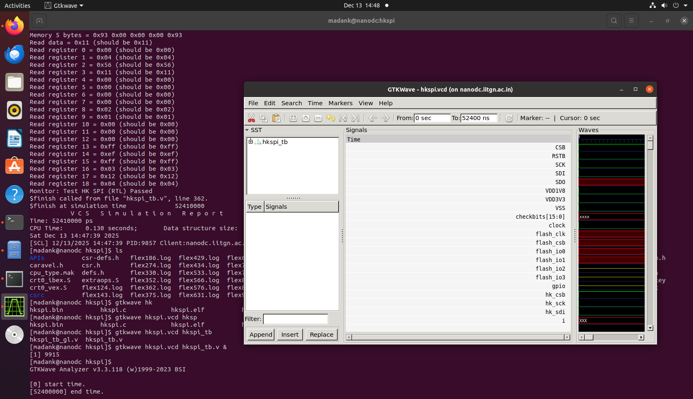
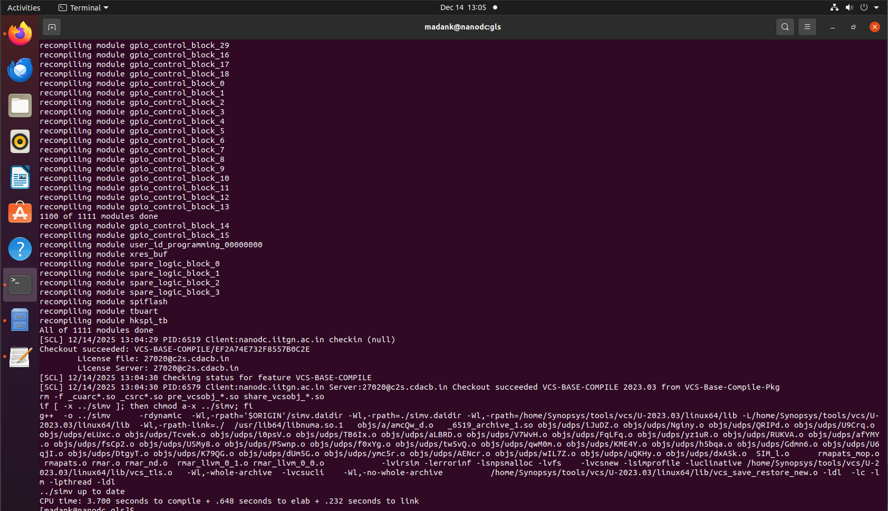
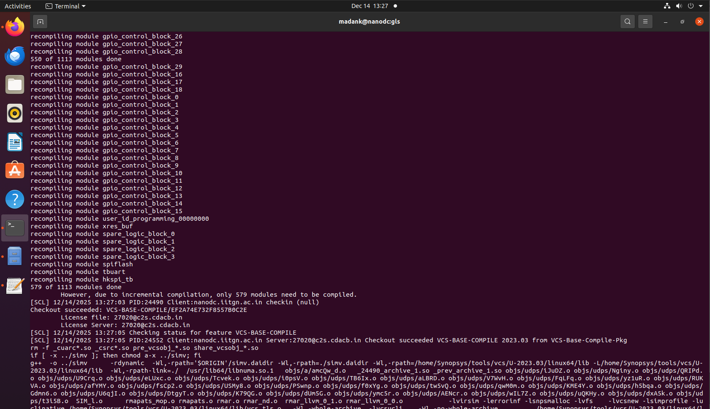

# RISC-V SoC Research Task — Synopsys VCS + DC_TOPO Flow (SCL180)

This repository documents the progressive implementation of functional simulation, synthesis, and gate-level simulation of the vsdcaravel RISC-V SoC using Synopsys tools on the SCL180 technology node. The objective of this work is to understand the complete RTL-to-GDS front-end flow, validate functionality at each stage, and study the behavior of the design after synthesis.

The flow begins with RTL-level functional verification, proceeds through topographical synthesis using Design Compiler Topo, and concludes with gate-level simulation using the synthesized netlist. Waveform inspection is carried out using GTKWave in place of Verdi.

## Tools used

* Synopsys VCS for RTL and gate-level simulation
* Synopsys Design Compiler Topographical mode for synthesis
* GTKWave for waveform visualization

## Environment setup

The vsdcaravel SoC source files are obtained by cloning the official repository and switching to the updated development branch.

```
git clone https://github.com/vsdip/vsdRiscvScl180.git
cd vsdRiscvScl180
git checkout iitgn
```

# Functional simulation

Functional simulation focuses on the housekeeping_spi module present in the vsdcaravel SoC. The corresponding testbench is located in the dv/hkspi directory. Simulation is performed using Synopsys VCS with functional defines enabled.

```
cd dv/hkspi/
```

The Synopsys environment is initialized before invoking VCS.

```
csh
source /home/madank/toolRC_iitgntapeout
```

The following command compiles the RTL and testbench and creates the simulation executable.

```
vcs -full64 -sverilog -timescale=1ns/1ps -debug_access+all \
    +incdir+../ +incdir+../../rtl +incdir+../../rtl/scl180_wrapper \
    +incdir+/home/Synopsys/pdk/SCL_PDK_3/SCLPDK_V3.0_KIT/scl180/iopad/cio250/6M1L/verilog/tsl18cio250/zero \
    +define+FUNCTIONAL +define+SIM \
    hkspi_tb.v -o simv
```

The simulation is executed and a VCD file is generated for waveform viewing.

```
./simv -no_save +define+DUMP_VCD=1 | tee sim_log.txt
```


All test cases pass successfully. The values read from registers 0 to 18 match the expected results, confirming correct functional behavior of the design.

Waveforms are viewed using GTKWave.

```
gtkwave hkspi.vcd hkspi_tb.v
```




# Synthesis

Synthesis of the vsdcaravel SoC is performed using Synopsys Design Compiler in topographical mode. The synthesis flow uses compile_ultra with incremental optimization to generate a timing-aware gate-level netlist.

The synthesis is run from the synthesis/work_folder directory using a TCL script located in the synthesis directory. This script reads the required standard cell and IO pad libraries, applies constraints, blackboxes selected modules, and generates reports.

The libraries used include SCL180 IO pad libraries and standard cell libraries in liberty DB format. The top module for synthesis is vsdcaravel, and the synthesized netlist is written to the synthesis/output directory.

Memory modules (RAM128, RAM256) and power-on-reset logic (dummy_por) are intentionally treated as blackboxes during synthesis to avoid implementation-specific dependencies. Corresponding blackbox module definitions are placed in the stubs directory.


An example blackbox definition for the dummy_por module is shown below.


Synthesis is launched using dc_shell.

```
dc_shell -f ../synth.tcl
```


The synthesized netlist is generated successfully and stored in the synthesis/output directory.


Inspection of the netlist confirms that the memory and POR modules are correctly preserved as blackboxes.

# Gate-level simulation (GLS)

Gate-level simulation is performed using the synthesized netlist to validate post-synthesis functional correctness. VCS is again used for this purpose, and simulation is run from the gls directory.

```
vcs -full64 -sverilog -timescale=1ns/1ps \
    -debug_access+all \
    +define+FUNCTIONAL+SIM+GL \
    +notimingchecks \
    hkspi_tb.v \
    +incdir+../synthesis/output \
    +incdir+/home/Synopsys/pdk/SCL_PDK_3/SCLPDK_V3.0_KIT/scl180/iopad/cio250/4M1L/verilog/tsl18cio250/zero \
    +incdir+/home/Synopsys/pdk/SCL_PDK_3/SCLPDK_V3.0_KIT/scl180/stdcell/fs120/4M1IL/verilog/vcs_sim_model \
    -o simv
```

Some compilation and simulation errors may occur during this stage. The specific issues encountered and their resolutions are documented [HERE](#errors-during-gate-level-simulation).



The simulation is executed and a VCD file is generated.

```
./simv -no_save +define+DUMP_VCD=1 | tee sim_log.txt
```


The output initially fails, producing unknown values. This behavior is expected because memory and POR modules were blackboxed during synthesis, resulting in undefined behavior during simulation.

To validate correct functionality, the blackbox definitions are removed and the original RTL implementations of these modules are included during gate-level simulation. The simulation is then recompiled and executed.



```
./simv -no_save +define+DUMP_VCD=1 | tee sim_log.txt
```


With the functional RTL of the memory and POR modules included, the gate-level simulation produces correct results that match the functional simulation.

Waveforms are again inspected using GTKWave.

```
gtkwave hkspi.vcd hkspi_tb.v
```


# Errors during gate-level simulation

A common error encountered during gate-level simulation is a port width mismatch. This occurs in the synthesized netlist where the mprj_io module instantiates the pc3b03_wrapper with multi-bit connections, while the wrapper module supports only single-bit ports.


The pc3b03_wrapper definition shows that it is designed for single-bit operation.


To resolve this issue, the pc3b03_wrapper module is instantiated multiple times, once for each bit of the multi-bit signal. A total of 38 instances are created to cover all input and output bits, eliminating the width mismatch and allowing the simulation to proceed successfully.


