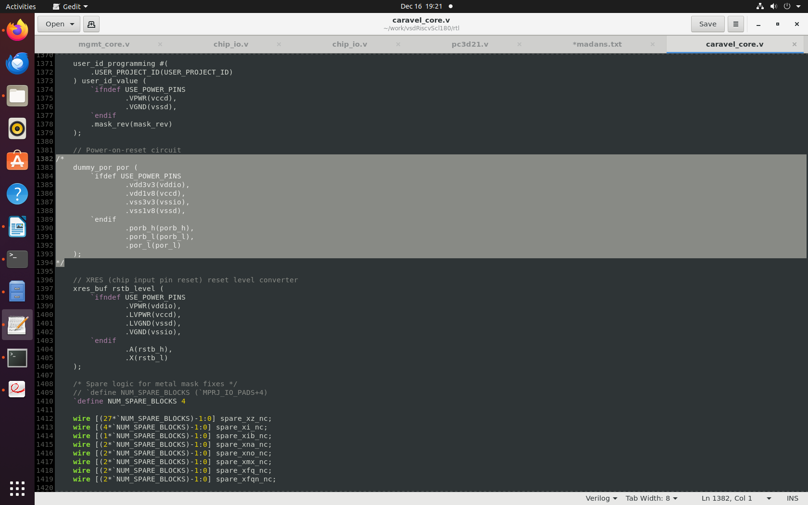
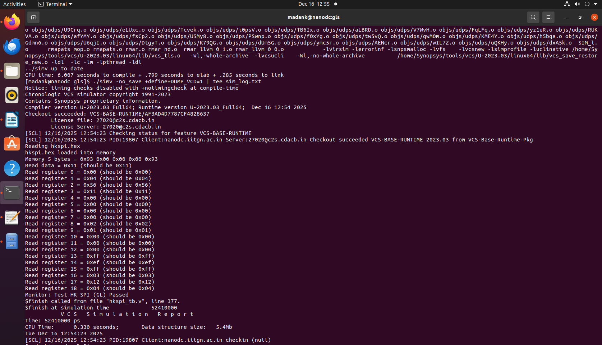
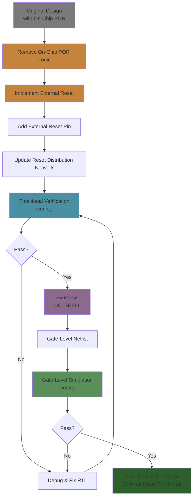
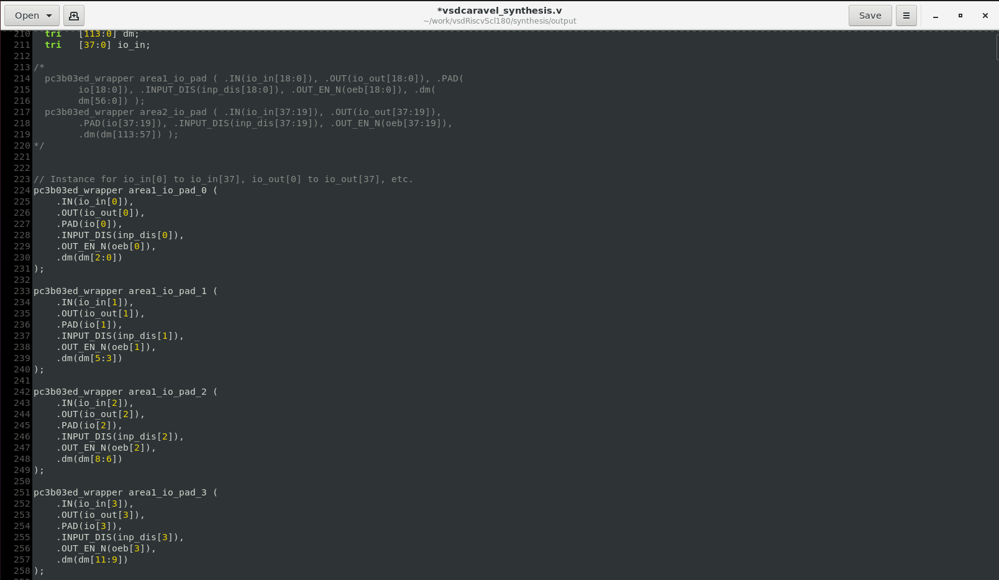

# RTL Synthesis and Verification with Post-Synthesis Chip-Interface Netlist Refinement and External Reset Integration

## Objective and Scope

* Demonstrate a production-style front-end flow (RTL simulation -> synthesis -> gate-level simulation) for the `vsdcaravel` RISC-V SoC using Synopsys VCS and Design Compiler on SCL-180.
* Prove that complete removal of internal Power-On Reset (POR) and reliance on a single external reset pad is functionally safe at RTL and GLS.
* Resolve chip-interface inconsistencies at the IO ring by refining the synthesized netlist, specifically the `mprj_io` module, using multiple pad wrapper instantiations to fix width mismatches.

---

## Design Overview

* **Top-level SoC**: `vsdcaravel`, a Caravel-style management SoC plus RISC-V core, adapted for SCL-180 technology.
* **Technology**: SCL-180 standard cell libraries and IO pad libraries (TSL18CIO250) in Liberty and Verilog formats.
* **Key IP blocks**:

  * Management SoC (housekeeping SPI, GPIO, IRQ, storage, mprj control).
  * IO ring including `mprj_io` and pad wrappers.
* **Reset architecture**: Transition from mixed POR + external reset to **external reset-only** (`resetb` driving all POR-related nets).

---

## Toolchain and Repositories

* **Tools**:

  * Synopsys **VCS**: RTL and gate-level simulations.
  * Synopsys **Design Compiler / dc_shell**: Topographical synthesis and QoR reporting.
  * **GTKWave**: Waveform viewing for both RTL and GLS VCDs.

* **Reference repository** (clone and branch):

  ```bash
  git clone https://github.com/vsdip/vsdRiscvScl180.git
  cd vsdRiscvScl180
  git checkout iitgn
  ```

* **RISC-V Toolchain** (for firmware, if needed): Ensure `GCCPATH` points to a valid `riscv32-unknown-elf-gcc` installation.

---

## External Reset Integration (POR Removal)

This section explains how the original on-chip POR (`dummypor`) was removed and replaced by a single external reset pad, and how this was validated at RTL and GLS.

### Rationale

* The SCL-180 flow expects reset to be driven from a dedicated external pad; the internal `dummypor` generator becomes redundant.
* Using a single, well-defined external reset simplifies timing, debug, and reuse across flows, while still providing reliable initialization.

### RTL Changes

1. **Remove `dummypor` generator**

   * Delete or comment out the `dummypor` instance in `caravelcore.v`.
   * Remove `dummypor.v` from both `rtl` and `gl` trees and clean up all `include` references.



2. **Repurpose POR nets**

   * Signals `porbh` and `porbl` are changed from `output` to `inout` at the `caravelcore` interface, and the same change is applied where `caravelcore` is instantiated in `vsdcaravel.v`.
   * At the top level, `porbh`, `porbl`, and `porl` are **tied directly** to the external reset signal `resetb`, ensuring that all internal logic previously driven by POR now follows the external reset.


3. **Single reset source**

   * After these changes, the **entire SoC reset behavior is controlled exclusively by `resetb`**, with no hidden internal POR sources.

### RTL Functional Validation

* **Testbench**: Housekeeping SPI (`hkspi`) testbench in `dv/hkspi`.

* **Compile command** (example):

  ```bash
  cd dv/hkspi
  csh
  source $HOME/madank/toolRC_iitgn_tapeout
  vcs -full64 -sverilog -timescale=1ns/1ps -debug_access+all \
      +incdir+.. +incdir+../rtl +incdir+../rtl/scl180_wrapper \
      +incdir+$HOME/Synopsys/pdk/SCLPDK3/SCLPDK_V3.0/KIT/scl180/io_pads/cio250_6M1L/verilog/tsl18cio250_zero \
      +define+FUNCTIONAL +define+SIM \
      hkspi_tb.v -o simv
  ./simv -nosave +define+DUMPVCD=1 | tee simlog.txt
  ```

* **Results**:

  * All housekeeping SPI registers (0–18) read back expected values after reset deassertion.
  * No unknown (`X`) propagation is seen in reset paths; re-asserting `resetb` in the testbench returns all architectural registers and peripherals to their default states.


### Synthesis and GLS Validation of Reset

* **Synthesis without POR**:

  * `dummypor` is completely absent from the synthesized `vsdcaravel` netlist; reset logic is driven only by external signals.
  * Memory macros (`RAM128`, `RAM256`) are either black-boxed or retained based on the specific run (dc_shell vs fully synthesized SRAM).

* **Gate-Level Simulation**:

  * Compile GLS with synthesized netlist plus IO/stdcell Verilog models.
  * Include RTL SRAM models (and any needed POR stubs only when validating older variants) to avoid `X` due to black-boxing.
  * Re-assert `resetb` in GLS; all peripheral outputs, e.g., housekeeping SPI SDO, return to reset defaults with no X-propagation, confirming **clean external reset behavior at gate level**.



* **Conclusion from reset validation**:

  * Complete removal of the on-chip POR, combined with an external reset-only scheme, is **safe and correct** for the SCL-180-based VSD Caravel SoC when the external pad is properly integrated.




---

## RTL Synthesis Flow

The synthesis flow generates a timing-aware netlist for `vsdcaravel` using SCL-180 libraries, while deliberately controlling how SRAM and POR are treated (black-box vs implemented).

### Libraries and Setup

* **Liberty DBs**:

  * SCL-180 IO pads: `tsl18cio250_min.db` (and related).
  * SCL-180 standard cells: `tsl18fs120_scl_ff.db` (and related).

* **Key TCL variables**:

  * `rootdir`: project root, e.g., `$HOME/madank/work/vsdRiscvScl180`.
  * `iolib`: IO pad Verilog models.
  * `verilogfiles`: RTL directory (`$rootdir/rtl`).
  * `topmodule`: `vsdcaravel`.

### Example Synthesis Script (POR-Free, dc_shell)

```
read_db "/home/Synopsys/pdk/SCL_PDK_3/SCLPDK_V3.0_KIT/scl180/iopad/cio250/4M1L/liberty/tsl18cio250_min.db"

read_db "/home/Synopsys/pdk/SCL_PDK_3/SCLPDK_V3.0_KIT/scl180/stdcell/fs120/4M1IL/liberty/lib_flow_ff/tsl18fs120_scl_ff.db"


set target_library "/home/Synopsys/pdk/SCL_PDK_3/SCLPDK_V3.0_KIT/scl180/iopad/cio250/4M1L/liberty/tsl18cio250_min.db /home/Synopsys/pdk/SCL_PDK_3/SCLPDK_V3.0_KIT/scl180/stdcell/fs120/4M1IL/liberty/lib_flow_ff/tsl18fs120_scl_ff.db"

set link_library {"* /home/Synopsys/pdk/SCL_PDK_3/SCLPDK_V3.0_KIT/scl180/iopad/cio250/4M1L/liberty/tsl18cio250_min.db /home/Synopsys/pdk/SCL_PDK_3/SCLPDK_V3.0_KIT/scl180/stdcell/fs120/4M1IL/liberty/lib_flow_ff/tsl18fs120_scl_ff.db"}

set_app_var target_library $target_library
set_app_var link_library $link_library


set root_dir "/home/madank/work/vsdRiscvScl180"
set io_lib "/home/Synopsys/pdk/SCL_PDK_3/SCLPDK_V3.0_KIT/scl180/iopad/cio250/4M1L/verilog/tsl18cio250/zero"
set verilog_files  "$root_dir/rtl"
set top_module "vsdcaravel" ;
set output_file "$root_dir/synthesis/output/vsdcaravel_synthesis.v"
set report_dir "$root_dir/synthesis/report"

read_file $verilog_files/defines.v

set blackboxes_dir "/home/madank/work/vsdRiscvScl180/stubs"

set blackbox_files [glob -nocomplain ${blackboxes_dir}/*.v]

read_file $blackbox_files -format verilog


# read all rtl files
set all_rtl_files [glob -nocomplain ${verilog_files}/*.v]


# all rtl files except the blackbox ones
set files_to_read [list]

foreach file $all_rtl_files {
	set indicator 0
	foreach bb_file $blackbox_files {
		if {[string equal $file $bb_file]} {
		    set indicator 1
		    break
		}
	}
	if{!indicator}{
		lappend files_to_read $file
	}
}

read_file $files_to_read -define USE_POWER_PINS -format verilog

elaborate $top_module


# Mark RAM128 as blackbox
if {[sizeof_collection [get_designs -quiet RAM128]] > 0} {
    set_attribute [get_designs RAM128] is_black_box true -quiet
    set_dont_touch [get_designs RAM128]
}

# Mark RAM256 as blackbox
if {[sizeof_collection [get_designs -quiet RAM256]] > 0} {
    set_attribute [get_designs RAM256] is_black_box true -quiet
    set_dont_touch [get_designs RAM256]
}


# Mark dummy_por as blackbox
if {[sizeof_collection [get_designs -quiet dummy_por]] > 0} {
    set_attribute [get_designs dummy_por] is_black_box true -quiet
    set_dont_touch [get_designs dummy_por]
}


# Handle any other POR-related modules (case insensitive)
foreach_in_collection por_design [get_designs -quiet "*por*"] {
    set design_name [get_object_name $por_design]
    if {![string equal $design_name "dummy_por"]} {
        set_dont_touch $por_design
        set_attribute $por_design is_black_box true -quiet
    }
}


# Protect all instances of RAM128, RAM256, and dummy_por
foreach blackbox_ref {"RAM128" "RAM256" "dummy_por"} {
    set instances [get_cells -quiet -hierarchical -filter "ref_name == $blackbox_ref"]
    if {[sizeof_collection $instances] > 0} {
        set_dont_touch $instances
        set inst_count [sizeof_collection $instances]
    }
}


link

uniquify

read_sdc "$root_dir/synthesis/vsdcaravel.sdc"

compile

write -format verilog -hierarchy -output $output_file
write -format ddc -hierarchy -output "$root_dir/synthesis/output/vsdcaravel_synthesis.ddc"
write_sdc "$root_dir/synthesis/output/vsdcaravel_synthesis.sdc"


report_area > "$report_dir/area.rpt"
report_power > "$report_dir/power.rpt"
report_timing -max_paths 10 > "$report_dir/timing.rpt"
report_constraint -all_violators > "$report_dir/constraints.rpt"
report_qor > "$report_dir/qor.rpt"
```

The script performs the following operations:

* Reads IO pad and stdcell DBs.
* Reads `defines.v`, RTL files, and blackbox stubs from `stubs/`.
* Marks `RAM128`, `RAM256`, and `dummypor` as `is_blackbox` and `dont_touch` when needed.
* Applies constraints from `vsdcaravel.sdc`.
* Runs `compile_ultra` or equivalent topographical compile.
* Writes out `vsdcaravel_synthesis.v`, a DDC, SDC, and QoR/power/area reports.

**Sample launch**:

```bash
cd synthesis_work_folder
dc_shell -f ../synth.tcl
```

### QoR, Area, and Power

* The resulting netlist includes on the order of 46k cells, with roughly 33k combinational and 6.8k sequential cells.
* Dynamic power is dominated by combinational and sequential logic; macro/black-box blocks contribute logically but not to internal power estimates.
* Timing summary shows 0 total negative slack at synthesis (no violating paths under the default constraints), though clock tree power is not yet included.

---

## Post-Synthesis Chip-Interface Netlist Refinement (mprj_io)

This section documents the chip-interface refinement performed after synthesis to cleanly integrate the IO ring and resolve pad wrapper mismatches, specifically in the `mprj_io` module.

### Problem: Port Width Mismatch in mprj_io

* In the synthesized netlist, `mprj_io` instantiates pad wrappers with **multi-bit** signal connections (e.g., buses for IO pads), while the actual wrapper RTL is defined with **single-bit** ports.
* This results in port width mismatches during GLS compilation and prevents clean gate-level simulation of the full chip interface.


### Refinement Strategy: Multiple Wrapper Instances

* To align the pad wrapper's interface with the synthesized multi-bit nets, the wrapper module is **instantiated once per bit** instead of as a single multi-bit instance.
* A total of **38 instances** are created to cover all input and output IO bits handled by `mprj_io`.

### Implementation Steps

1. **Identify affected connections**

   * Analyze the synthesized `mprj_io` netlist and map all multi-bit signals connected to the pad wrapper.

2. **Create per-bit instances**

   * Replace the single multi-bit instantiation with **38 scalar instances**, each wiring one bit of the bus to a single-bit wrapper port.
   * Maintain consistent naming for debug and layout correlation.




3. **Preserve constraints and hierarchy**

   * Ensure that the refined `mprj_io` remains structurally equivalent from the synthesis and STA perspective (no added logic, only interface reshaping).
   * Keep the IO ring flat enough for downstream backend tools while not altering internal timing assumptions.

4. **Update GLS file list**

   * Include the refined `mprj_io` and the pad wrapper definition in the GLS compile list so that all pad wrappers elaborate correctly.

### Effect on Verification

* After refinement, GLS no longer reports width mismatch errors on `mprj_io` connections.
* Full-chip gate-level simulation can now progress through pad-level interfaces, enabling more realistic verification of external IO behavior along with reset.

---

## Verification Matrix: RTL vs Synthesis vs GLS

| Aspect                       | RTL (Functional)                                                                            | Synthesis (Netlist)                                                      | GLS (Gate-Level Simulation)                                                                   |
| ---------------------------- | ------------------------------------------------------------------------------------------- | ------------------------------------------------------------------------ | --------------------------------------------------------------------------------------------- |
| POR handling                 | `dummypor` removed; `porbh/porbl/porl` tied to `resetb`.                                    | `dummypor` absent or black-boxed; netlist driven by external reset only. | GLS with synthesized netlist + RTL memories; resetb controls all logic.                       |
| Reset validation             | Re-assert `resetb`; all regs/peripherals return to defaults; no X on reset paths.           | Reports confirm no POR logic; reset nets traced to IO pad.               | Re-assert `resetb`; housekeeping SPI SDO and others return to default; clean waveforms.       |
| IO ring (`mprj_io`)          | Behavior modeled at RTL; wrapper defined as single-bit.                                     | Synthesized with multi-bit connections; mismatch appears in GLS.         | Post-synthesis netlist refined with 38 single-bit instances; GLS passes without width errors. |
| Memories (RAM128/256)        | RTL models used for functional behavior.                                                    | Often black-boxed in dc_shell; preserved as abstract macros.             | GLS includes RTL memory models to avoid X-propagation from blackboxes.                        |
| DV coverage (Mgmt SoC tests) | Caravel management DV tests (e.g., hkspi) pass unmodified, demonstrating reset correctness. | Same DV intent assumed; synthesis preserves functional semantics.        | DV tests re-run on GLS netlist; matching behavior confirms full-stack consistency.            |

---

## How to Reproduce the Flow

### 1. Environment Setup

Clone the repo and check out the `iitgn` branch:

```bash
git clone https://github.com/vsdip/vsdRiscvScl180.git
cd vsdRiscvScl180
git checkout iitgn
```

Configure Synopsys tool environment (VCS, DC) according to local installation; source the provided `toolRC` script. Ensure SCL-180 IO/stdcell libraries and Verilog models are accessible at the paths referenced in `synth.tcl` and simulation scripts.

### 2. Run RTL Functional Simulation

Navigate to the housekeeping SPI DV directory:

```bash
cd dv/hkspi
make vvp hkspi.vvp   # or VCS flow as shown earlier
gtkwave hkspi.vcd hkspi_tb.v
```

Confirm:

* Register reads 0–18 match expected values.
* Reset re-assertion via `resetb` returns logic to default states with no X's.

### 3. Run Synthesis (POR-Free)

Move to the synthesis directory:

```bash
cd synthesis
# Edit synth.tcl to match your library paths
dc_shell -f ../synth.tcl
```

Inspect reports in `synthesis_report/` for area, timing, and power, verifying absence of internal POR logic in the netlist.

### 4. Apply Chip-Interface Netlist Refinement

Edit the synthesized or GLS-target netlist for `mprj_io` to:

* Replace multi-bit wrapper instantiations with 38 scalar instances.
* Retain pin names and directions consistent with pad models.

Add the refined `mprj_io` source to the GLS file list.

### 5. Run Gate-Level Simulation

Use the GLS directory and a simulator with:

* Synthesized `vsdcaravel_synthesis.v`.
* Refined `mprj_io` and pad wrappers.
* RTL SRAM models (`RAM128.v`, `RAM256.v`) if memories were black-boxed.

**Example (VCS)**:

```bash
vcs -full64 -sverilog -timescale=1ns/1ps -debug_access+all \
    +define+FUNCTIONAL +define+SIM_GL +notimingchecks \
    hkspi_tb.v \
    +incdir+../synthesis_output \
    +incdir+$HOME/Synopsys/pdk/SCLPDK3/SCLPDK_V3.0/KIT/scl180/io_pads/cio250_4M1L/verilog/tsl18cio250_zero \
    +incdir+$HOME/Synopsys/pdk/SCLPDK3/SCLPDK_V3.0/KIT/scl180/stdcell/fs120_4M1IL/verilog/vcs_sim_model \
    -o simv
./simv -nosave +define+DUMPVCD=1 | tee simlog.txt
```

Verify:

* No port width mismatch errors from `mprj_io`.
* GLS register outputs and waveforms match RTL behavior.

---

## Summary of Contributions

* Established a robust **RTL -> synthesis -> GLS** flow for `vsdcaravel` on SCL-180 using Synopsys tools.
* Proved that **external reset-only** operation (with POR removed) is functionally correct and stable across all abstraction levels and DV runs.
* Refined the **chip-interface netlist** by restructuring `mprj_io` around multiple wrapper instances, eliminating pad-width mismatches and enabling full-chip GLS through the actual pad interface.
