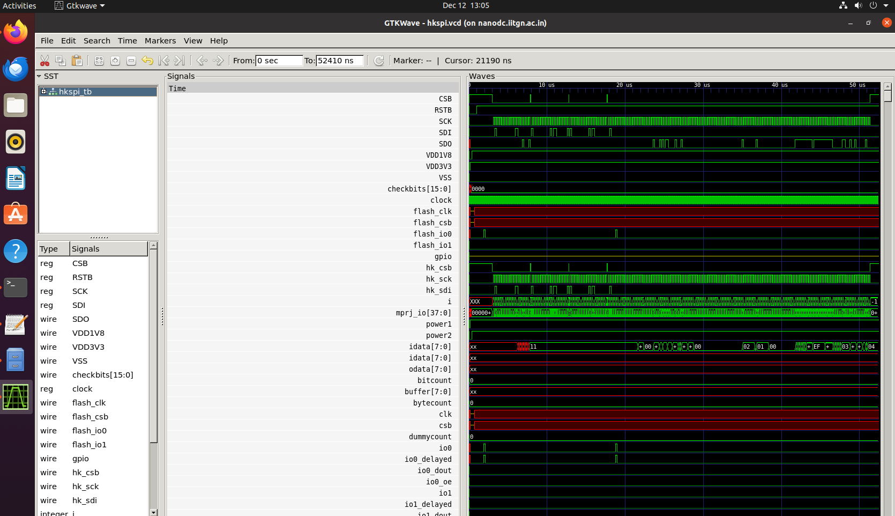
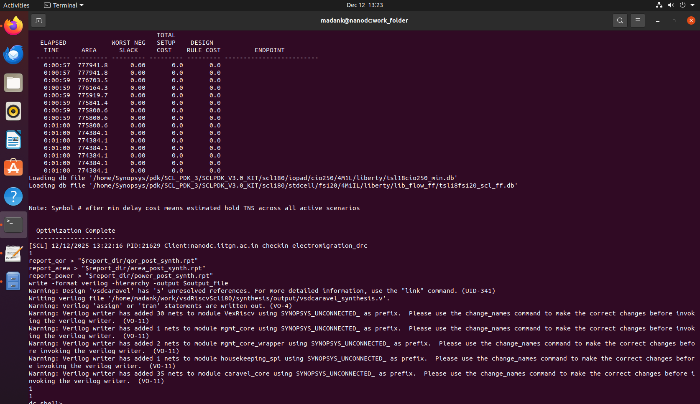
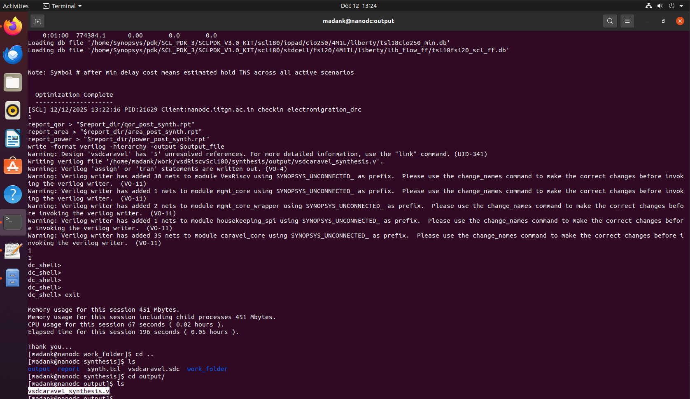
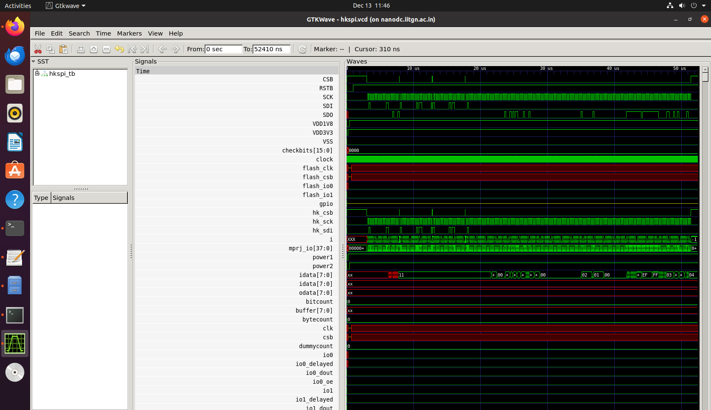

# RISC-V Reference SoC — Functional and Gate-Level Simulation (SCL180)

This document provides a unified overview of the Functional Simulation, Gate-Level Simulation (GLS), and Synthesis flow for the RISC-V Reference SoC implemented using the SCL180 technology node. The steps below guide you through environment setup, simulation, waveform viewing, and synthesis using Synopsys Design Compiler.

## Environment Setup

Clone the repository and switch to the correct branch:

```
git clone https://github.com/vsdip/vsdRiscvScl180.git
cd vsdRiscvScl180
git checkout iitgn
```

Ensure that the `GCC_PATH` variable is correctly configured to point to your RISC-V GNU Toolchain installation directory.
If you do not already have the RISC-V toolchain installed, download it from the official source:

[https://github.com/riscv-collab/riscv-gnu-toolchain/releases/](https://github.com/riscv-collab/riscv-gnu-toolchain/releases/)

A correct RISC-V toolchain setup is essential because the SoC firmware is compiled using `riscv32-unknown-elf-gcc`.


## Functional Simulation

Navigate to the HK-SPI test directory:

```
cd dv/hkspi/
```

Open the `Makefile` and verify that `GCC_PATH` refers to your correct RISC-V toolchain path.
If an old simulation output file (`hkspi.vvp`) exists in the folder, delete it before running a fresh simulation.

Compile and run the functional simulation:

```
make
vvp hkspi.vvp
```

Functional simulation successful output:


To analyze waveforms, open the VCD file using GTKWave:

```
gtkwave hkspi.vcd hkspi_tb.v
```




## Synthesis (Synopsys Design Compiler)

Move to the synthesis directory:

```
cd synthesis/
```

Open `synth.tcl` and update:

* library paths
* technology files
* target and link libraries
* any environment-specific variables

Once configured, run Design Compiler:

```
dc_shell -f ../synth.tcl
```

Synopsys DC shell reference:


After synthesis completes, the generated netlist and reports will be located in:

```
synthesis/output/
```

Output directory reference:


Final synthesized netlist:


# Gate-level SImulation

The gate level simulation is performed using iverilog and gtkwave. for that, go to gls/ directory.

```
make
vvp hkspi.vvp
```


Now view the waveform using gtkwave

```
gtkwave hkspi.vcd hkspi_tb.v
```


