# RISC-V SoC Research Task — Synopsys VCS + DC_TOPO Flow (SCL180)

This repository documents the progressive implementation of functional simulation, synthesis, and gate-level simulation of the vsdcaravel RISC-V SoC using Synopsys tools on the SCL180 technology node. The objective of this work is to understand the complete RTL-to-GDS front-end flow, validate functionality at each stage, and study the behavior of the design after synthesis.

The flow begins with RTL-level functional verification, proceeds through topographical synthesis using Design Compiler Topo, and concludes with gate-level simulation using the synthesized netlist. Waveform inspection is carried out using GTKWave in place of Verdi.

## Tools used

* Synopsys VCS for RTL and gate-level simulation
* Synopsys Design Compiler Topographical mode for synthesis
* GTKWave for waveform visualization

## Environment setup

The vsdcaravel SoC source files are obtained by cloning the official repository and switching to the updated development branch.

```
git clone https://github.com/vsdip/vsdRiscvScl180.git
cd vsdRiscvScl180
git checkout iitgn
```

# Functional simulation

Functional simulation focuses on the housekeeping_spi module present in the vsdcaravel SoC. The corresponding testbench is located in the dv/hkspi directory. Simulation is performed using Synopsys VCS with functional defines enabled.

```
cd dv/hkspi/
```

The Synopsys environment is initialized before invoking VCS.

```
csh
source /home/madank/toolRC_iitgntapeout
```

The following command compiles the RTL and testbench and creates the simulation executable.

```
vcs -full64 -sverilog -timescale=1ns/1ps -debug_access+all \
    +incdir+../ +incdir+../../rtl +incdir+../../rtl/scl180_wrapper \
    +incdir+/home/Synopsys/pdk/SCL_PDK_3/SCLPDK_V3.0_KIT/scl180/iopad/cio250/6M1L/verilog/tsl18cio250/zero \
    +define+FUNCTIONAL +define+SIM \
    hkspi_tb.v -o simv
```

The simulation is executed and a VCD file is generated for waveform viewing.

```
./simv -no_save +define+DUMP_VCD=1 | tee sim_log.txt
```

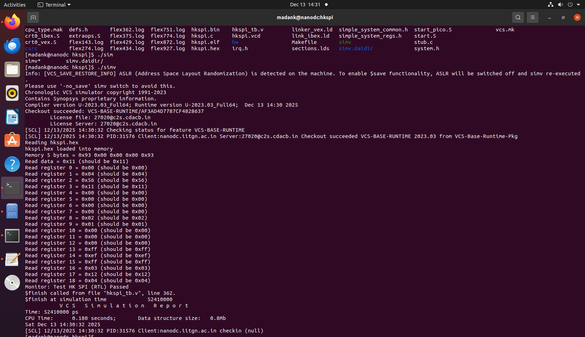

All test cases pass successfully. The values read from registers 0 to 18 match the expected results, confirming correct functional behavior of the design.

Waveforms are viewed using GTKWave.

```
gtkwave hkspi.vcd hkspi_tb.v
```


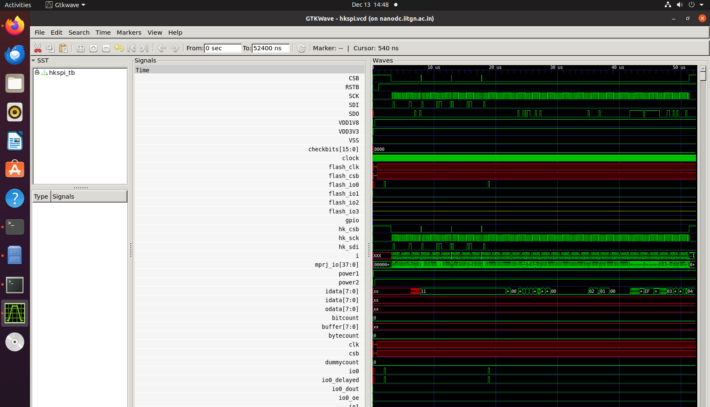

# Synthesis

Synthesis of the vsdcaravel SoC is performed using Synopsys Design Compiler in topographical mode. The synthesis flow uses compile_ultra with incremental optimization to generate a timing-aware gate-level netlist.

The synthesis is run from the synthesis/work_folder directory using a TCL script located in the synthesis directory. This script reads the required standard cell and IO pad libraries, applies constraints, blackboxes selected modules, and generates reports.

The libraries used include SCL180 IO pad libraries and standard cell libraries in liberty DB format. The top module for synthesis is vsdcaravel, and the synthesized netlist is written to the synthesis/output directory.

Memory modules (RAM128, RAM256) and power-on-reset logic (dummy_por) are intentionally treated as blackboxes during synthesis to avoid implementation-specific dependencies. Corresponding blackbox module definitions are placed in the stubs directory.

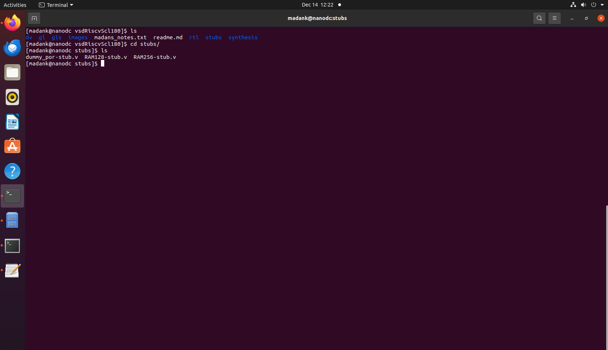

An example blackbox definition for the dummy_por module is shown below.

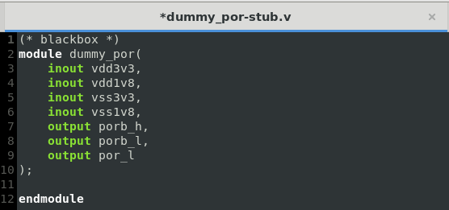

Used this synth.tcl file for synthesis:

```tcl
read_db "/home/Synopsys/pdk/SCL_PDK_3/SCLPDK_V3.0_KIT/scl180/iopad/cio250/4M1L/liberty/tsl18cio250_min.db"

read_db "/home/Synopsys/pdk/SCL_PDK_3/SCLPDK_V3.0_KIT/scl180/stdcell/fs120/4M1IL/liberty/lib_flow_ff/tsl18fs120_scl_ff.db"


set target_library "/home/Synopsys/pdk/SCL_PDK_3/SCLPDK_V3.0_KIT/scl180/iopad/cio250/4M1L/liberty/tsl18cio250_min.db /home/Synopsys/pdk/SCL_PDK_3/SCLPDK_V3.0_KIT/scl180/stdcell/fs120/4M1IL/liberty/lib_flow_ff/tsl18fs120_scl_ff.db"

set link_library {"* /home/Synopsys/pdk/SCL_PDK_3/SCLPDK_V3.0_KIT/scl180/iopad/cio250/4M1L/liberty/tsl18cio250_min.db /home/Synopsys/pdk/SCL_PDK_3/SCLPDK_V3.0_KIT/scl180/stdcell/fs120/4M1IL/liberty/lib_flow_ff/tsl18fs120_scl_ff.db"}

set_app_var target_library $target_library
set_app_var link_library $link_library


set root_dir "/home/madank/work/vsdRiscvScl180"
set io_lib "/home/Synopsys/pdk/SCL_PDK_3/SCLPDK_V3.0_KIT/scl180/iopad/cio250/4M1L/verilog/tsl18cio250/zero"
set verilog_files  "$root_dir/rtl"
set top_module "vsdcaravel" ;
set output_file "$root_dir/synthesis/output/vsdcaravel_synthesis.v"
set report_dir "$root_dir/synthesis/report"

read_file $verilog_files/defines.v

set blackboxes_dir "/home/madank/work/vsdRiscvScl180/stubs"

set blackbox_files [glob -nocomplain ${blackboxes_dir}/*.v]

read_file $blackbox_files -format verilog


# read all rtl files
set all_rtl_files [glob -nocomplain ${verilog_files}/*.v]


# all rtl files except the blackbox ones
set files_to_read [list]

foreach file $all_rtl_files {
	set indicator 0
	foreach bb_file $blackbox_files {
		if {[string equal $file $bb_file]} {
		    set indicator 1
		    break
		}
	}
	if{!indicator}{
		lappend files_to_read $file
	}
}

read_file $files_to_read -define USE_POWER_PINS -format verilog

elaborate $top_module


# Mark RAM128 as blackbox
if {[sizeof_collection [get_designs -quiet RAM128]] > 0} {
    set_attribute [get_designs RAM128] is_black_box true -quiet
    set_dont_touch [get_designs RAM128]
}

# Mark RAM256 as blackbox
if {[sizeof_collection [get_designs -quiet RAM256]] > 0} {
    set_attribute [get_designs RAM256] is_black_box true -quiet
    set_dont_touch [get_designs RAM256]
}


# Mark dummy_por as blackbox
if {[sizeof_collection [get_designs -quiet dummy_por]] > 0} {
    set_attribute [get_designs dummy_por] is_black_box true -quiet
    set_dont_touch [get_designs dummy_por]
}


# Handle any other POR-related modules (case insensitive)
foreach_in_collection por_design [get_designs -quiet "*por*"] {
    set design_name [get_object_name $por_design]
    if {![string equal $design_name "dummy_por"]} {
        set_dont_touch $por_design
        set_attribute $por_design is_black_box true -quiet
    }
}


# Protect all instances of RAM128, RAM256, and dummy_por
foreach blackbox_ref {"RAM128" "RAM256" "dummy_por"} {
    set instances [get_cells -quiet -hierarchical -filter "ref_name == $blackbox_ref"]
    if {[sizeof_collection $instances] > 0} {
        set_dont_touch $instances
        set inst_count [sizeof_collection $instances]
    }
}


link

uniquify

read_sdc "$root_dir/synthesis/vsdcaravel.sdc"

compile

write -format verilog -hierarchy -output $output_file
write -format ddc -hierarchy -output "$root_dir/synthesis/output/vsdcaravel_synthesis.ddc"
write_sdc "$root_dir/synthesis/output/vsdcaravel_synthesis.sdc"


report_area > "$report_dir/area.rpt"
report_power > "$report_dir/power.rpt"
report_timing -max_paths 10 > "$report_dir/timing.rpt"
report_constraint -all_violators > "$report_dir/constraints.rpt"
report_qor > "$report_dir/qor.rpt"
```

Synthesis is launched using dc_shell.

```
dc_shell -f ../synth.tcl
```


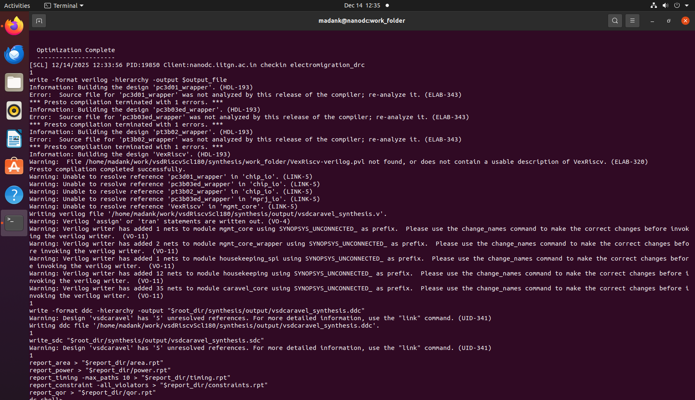

The synthesized netlist is generated successfully and stored in the synthesis/output directory.

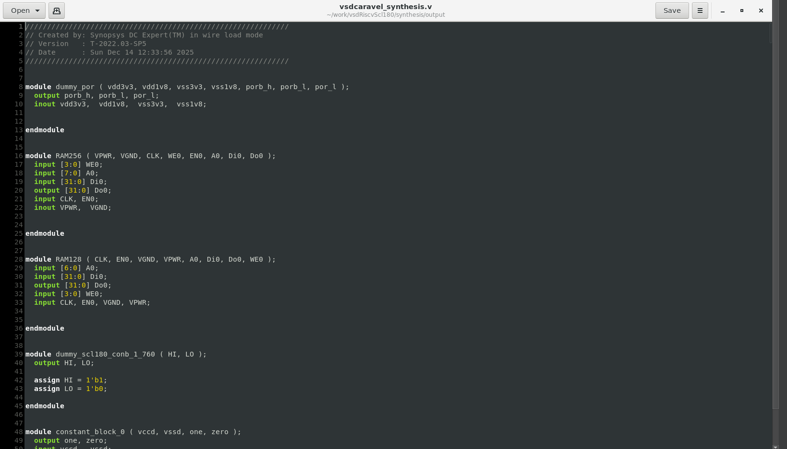

Inspection of the netlist confirms that the memory and POR modules are correctly preserved as blackboxes.

Area report:

```
Warning: Design 'vsdcaravel' has '2' unresolved references. For more detailed information, use the "link" command. (UID-341)
 
****************************************
Report : area
Design : vsdcaravel
Version: T-2022.03-SP5
Date   : Sat Dec 13 17:23:50 2025
****************************************

Library(s) Used:

    tsl18fs120_scl_ff (File: /home/Synopsys/pdk/SCL_PDK_3/SCLPDK_V3.0_KIT/scl180/stdcell/fs120/4M1IL/liberty/lib_flow_ff/tsl18fs120_scl_ff.db)

Number of ports:                        13006
Number of nets:                         53083
Number of cells:                        46266
Number of combinational cells:          33138
Number of sequential cells:              6882
Number of macros/black boxes:              16
Number of buf/inv:                       8932
Number of references:                       2

Combinational area:             628374.965673
Buf/Inv area:                   135927.781186
Noncombinational area:          431851.769135
Macro/Black Box area:              100.320000
Net Interconnect area:           41490.622079

Total cell area:               1060327.054807
Total area:                    1101817.676887

Information: This design contains black box (unknown) components. (RPT-8)
1
```

Power report:

```

Global Operating Voltage = 1.98 
Power-specific unit information :
    Voltage Units = 1V
    Capacitance Units = 1.000000pf
    Time Units = 1ns
    Dynamic Power Units = 1mW    (derived from V,C,T units)
    Leakage Power Units = 1pW


Attributes
----------
i - Including register clock pin internal power


  Cell Internal Power  =  49.4045 mW   (54%)
  Net Switching Power  =  41.7868 mW   (46%)
                         ---------
Total Dynamic Power    =  91.1913 mW  (100%)

Cell Leakage Power     =   1.6607 uW

Information: report_power power group summary does not include estimated clock tree power. (PWR-789)

                 Internal         Switching           Leakage            Total
Power Group      Power            Power               Power              Power   (   %    )  Attrs
--------------------------------------------------------------------------------------------------
io_pad             0.0000            0.0000            0.0000            0.0000  (   0.00%)
memory             0.0000            0.0000            0.0000            0.0000  (   0.00%)
black_box          0.0000            0.1368           62.7200            0.1368  (   0.15%)
clock_network      0.0000            0.0000            0.0000            0.0000  (   0.00%)  i
register           0.0000            0.0000            0.0000            0.0000  (   0.00%)
sequential        29.3067            0.4128        7.2272e+05           29.7201  (  32.60%)
combinational     20.0961           41.2042        9.3789e+05           61.3010  (  67.25%)
--------------------------------------------------------------------------------------------------
Total             49.4028 mW        41.7539 mW     1.6607e+06 pW        91.1579 mW
1
```

QOR Report:

```
Information: Building the design 'chip_io'. (HDL-193)
Warning: Cannot find the design 'chip_io' in the library 'WORK'. (LBR-1)
Information: Building the design 'dummy_por'. (HDL-193)
Warning: Cannot find the design 'dummy_por' in the library 'WORK'. (LBR-1)
Warning: Unable to resolve reference 'chip_io' in 'vsdcaravel'. (LINK-5)
Warning: Unable to resolve reference 'dummy_por' in 'caravel_core'. (LINK-5)
Information: Updating design information... (UID-85)
Information: Timing loop detected. (OPT-150)
	chip_core/housekeeping/U4227/I chip_core/housekeeping/U4227/Z chip_core/housekeeping/U4234/I chip_core/housekeeping/U4234/Z chip_core/housekeeping/wbbd_sck_reg/CP chip_core/housekeeping/wbbd_sck_reg/Q chip_core/housekeeping/U921/A1 chip_core/housekeeping/U921/ZN chip_core/housekeeping/U920/A chip_core/housekeeping/U920/ZN chip_core/housekeeping/U2152/I chip_core/housekeeping/U2152/Z chip_core/housekeeping/U2148/I chip_core/housekeeping/U2148/Z chip_core/housekeeping/U3770/I chip_core/housekeeping/U3770/Z chip_core/housekeeping/U3763/I chip_core/housekeeping/U3763/Z chip_core/housekeeping/U2232/I chip_core/housekeeping/U2232/Z chip_core/housekeeping/pll_trim_reg_5_/CP chip_core/housekeeping/pll_trim_reg_5_/Q chip_core/pll/U7/A1 chip_core/pll/U7/Z chip_core/pll/ringosc/dstage_5__id/delayenb0/EN chip_core/pll/ringosc/dstage_5__id/delayenb0/ZN chip_core/pll/ringosc/ibufp10/I chip_core/pll/ringosc/ibufp10/ZN chip_core/pll/ringosc/ibufp11/I chip_core/pll/ringosc/ibufp11/ZN chip_core/pll/clockp_buffer_1/I chip_core/pll/clockp_buffer_1/Z chip_core/clock_ctrl/divider/odd_0/out_counter2_reg/CPN chip_core/clock_ctrl/divider/odd_0/out_counter2_reg/Q chip_core/clock_ctrl/divider/odd_0/C160/A1 chip_core/clock_ctrl/divider/odd_0/C160/Z chip_core/clock_ctrl/divider/C32/A1 chip_core/clock_ctrl/divider/C32/Z chip_core/clock_ctrl/divider/C31/A1 chip_core/clock_ctrl/divider/C31/Z chip_core/clock_ctrl/divider/C30/A1 chip_core/clock_ctrl/divider/C30/Z chip_core/clock_ctrl/U8/A1 chip_core/clock_ctrl/U8/Z chip_core/clock_ctrl/U7/I chip_core/clock_ctrl/U7/ZN chip_core/clock_ctrl/U11/I chip_core/clock_ctrl/U11/Z chip_core/U1/I chip_core/U1/Z 
Information: Timing loop detected. (OPT-150)
	chip_core/housekeeping/U2149/I chip_core/housekeeping/U2149/Z chip_core/housekeeping/U3773/I chip_core/housekeeping/U3773/Z chip_core/housekeeping/U3754/I chip_core/housekeeping/U3754/Z chip_core/housekeeping/U3721/I chip_core/housekeeping/U3721/Z chip_core/housekeeping/gpio_configure_reg_3__3_/CP chip_core/housekeeping/gpio_configure_reg_3__3_/QN chip_core/housekeeping/U473/I chip_core/housekeeping/U473/ZN chip_core/housekeeping/I_246/I chip_core/housekeeping/I_246/ZN chip_core/housekeeping/C19487/A1 chip_core/housekeeping/C19487/Z chip_core/housekeeping/C19490/A1 chip_core/housekeeping/C19490/Z chip_core/housekeeping/U1047/I chip_core/housekeeping/U1047/ZN chip_core/housekeeping/U920/B1 chip_core/housekeeping/U920/ZN chip_core/housekeeping/U2152/I chip_core/housekeeping/U2152/Z 
Warning: Disabling timing arc between pins 'CP' and 'Q' on cell 'chip_core/housekeeping/wbbd_sck_reg'
         to break a timing loop. (OPT-314)
Warning: Disabling timing arc between pins 'CP' and 'QN' on cell 'chip_core/housekeeping/gpio_configure_reg_3__3_'
         to break a timing loop. (OPT-314)
Warning: Disabling timing arc between pins 'CP' and 'Q' on cell 'chip_core/housekeeping/hkspi_disable_reg'
         to break a timing loop. (OPT-314)
Warning: Disabling timing arc between pins 'CP' and 'Q' on cell 'chip_core/pll/pll_control/tval_reg_6_'
         to break a timing loop. (OPT-314)
Warning: Disabling timing arc between pins 'CP' and 'QN' on cell 'chip_core/pll/pll_control/tval_reg_2_'
         to break a timing loop. (OPT-314)
Warning: Disabling timing arc between pins 'CP' and 'Q' on cell 'chip_core/pll/pll_control/tval_reg_3_'
         to break a timing loop. (OPT-314)
Warning: Disabling timing arc between pins 'CP' and 'Q' on cell 'chip_core/pll/pll_control/tval_reg_4_'
         to break a timing loop. (OPT-314)
Warning: Disabling timing arc between pins 'CP' and 'Q' on cell 'chip_core/pll/pll_control/tval_reg_5_'
         to break a timing loop. (OPT-314)
Warning: Disabling timing arc between pins 'I' and 'ZN' on cell 'chip_core/pll/ringosc/dstage_6__id/delayenb0'
         to break a timing loop. (OPT-314)
Warning: Disabling timing arc between pins 'CP' and 'Q' on cell 'chip_core/clock_ctrl/divider/syncN_reg_0_'
         to break a timing loop. (OPT-314)
Warning: Disabling timing arc between pins 'CP' and 'Q' on cell 'chip_core/clock_ctrl/divider/syncN_reg_2_'
         to break a timing loop. (OPT-314)
Warning: Disabling timing arc between pins 'CP' and 'Q' on cell 'chip_core/clock_ctrl/divider/syncN_reg_1_'
         to break a timing loop. (OPT-314)
Warning: Disabling timing arc between pins 'CP' and 'QN' on cell 'chip_core/clock_ctrl/divider/syncN_reg_1_'
         to break a timing loop. (OPT-314)
Warning: Disabling timing arc between pins 'CP' and 'Q' on cell 'chip_core/housekeeping/wbbd_busy_reg'
         to break a timing loop. (OPT-314)
Warning: Disabling timing arc between pins 'I' and 'ZN' on cell 'chip_core/pll/ringosc/dstage_0__id/delayenb0'
         to break a timing loop. (OPT-314)
Warning: Disabling timing arc between pins 'I' and 'ZN' on cell 'chip_core/pll/ringosc/dstage_6__id/delayenb1'
         to break a timing loop. (OPT-314)
Warning: Disabling timing arc between pins 'I' and 'ZN' on cell 'chip_core/pll/ringosc/dstage_6__id/delayen1'
         to break a timing loop. (OPT-314)
Warning: Disabling timing arc between pins 'CP' and 'Q' on cell 'chip_core/clock_ctrl/divider2/syncN_reg_0_'
         to break a timing loop. (OPT-314)
Warning: Disabling timing arc between pins 'CP' and 'Q' on cell 'chip_core/clock_ctrl/divider2/syncN_reg_2_'
         to break a timing loop. (OPT-314)
Warning: Disabling timing arc between pins 'CP' and 'Q' on cell 'chip_core/clock_ctrl/divider2/syncN_reg_1_'
         to break a timing loop. (OPT-314)
Warning: Disabling timing arc between pins 'CP' and 'QN' on cell 'chip_core/clock_ctrl/divider2/syncN_reg_1_'
         to break a timing loop. (OPT-314)
 
****************************************
Report : qor
Design : vsdcaravel
Version: T-2022.03-SP5
Date   : Sat Dec 13 17:23:50 2025
****************************************


  Timing Path Group (none)
  -----------------------------------
  Levels of Logic:               1.00
  Critical Path Length:          0.00
  Critical Path Slack:         uninit
  Critical Path Clk Period:       n/a
  Total Negative Slack:          0.00
  No. of Violating Paths:        0.00
  Worst Hold Violation:          0.00
  Total Hold Violation:          0.00
  No. of Hold Violations:        0.00
  -----------------------------------


  Cell Count
  -----------------------------------
  Hierarchical Cell Count:       1441
  Hierarchical Port Count:      12943
  Leaf Cell Count:              40036
  Buf/Inv Cell Count:            8932
  Buf Cell Count:                1073
  Inv Cell Count:                7861
  CT Buf/Inv Cell Count:            0
  Combinational Cell Count:     33212
  Sequential Cell Count:         6824
  Macro Count:                      0
  -----------------------------------


  Area
  -----------------------------------
  Combinational Area:   628374.965673
  Noncombinational Area:
                        431851.769135
  Buf/Inv Area:         135927.781186
  Total Buffer Area:         67849.80
  Total Inverter Area:       68209.70
  Macro/Black Box Area:    100.320000
  Net Area:              41490.622079
  -----------------------------------
  Cell Area:           1060327.054807
  Design Area:         1101817.676887


  Design Rules
  -----------------------------------
  Total Number of Nets:         45408
  Nets With Violations:           105
  Max Trans Violations:             0
  Max Cap Violations:             105
  -----------------------------------


  Hostname: nanodc.iitgn.ac.in

  Compile CPU Statistics
  -----------------------------------------
  Resource Sharing:                    8.40
  Logic Optimization:                 13.23
  Mapping Optimization:                5.25
  -----------------------------------------
  Overall Compile Time:               30.71
  Overall Compile Wall Clock Time:    31.23

  --------------------------------------------------------------------

  Design  WNS: 0.00  TNS: 0.00  Number of Violating Paths: 0


  Design (Hold)  WNS: 0.00  TNS: 0.00  Number of Violating Paths: 0

  --------------------------------------------------------------------


1
```

# Gate-level simulation (GLS)

Gate-level simulation is performed using the synthesized netlist to validate post-synthesis functional correctness. VCS is again used for this purpose, and simulation is run from the gls directory.

```
vcs -full64 -sverilog -timescale=1ns/1ps \
    -debug_access+all \
    +define+FUNCTIONAL+SIM+GL \
    +notimingchecks \
    hkspi_tb.v \
    +incdir+../synthesis/output \
    +incdir+/home/Synopsys/pdk/SCL_PDK_3/SCLPDK_V3.0_KIT/scl180/iopad/cio250/4M1L/verilog/tsl18cio250/zero \
    +incdir+/home/Synopsys/pdk/SCL_PDK_3/SCLPDK_V3.0_KIT/scl180/stdcell/fs120/4M1IL/verilog/vcs_sim_model \
    -o simv
```

Some compilation and simulation errors may occur during this stage. The specific issues encountered and their resolutions are documented [HERE](#errors-during-gate-level-simulation).


The simulation is executed and a VCD file is generated.

```
./simv -no_save +define+DUMP_VCD=1 | tee sim_log.txt
```

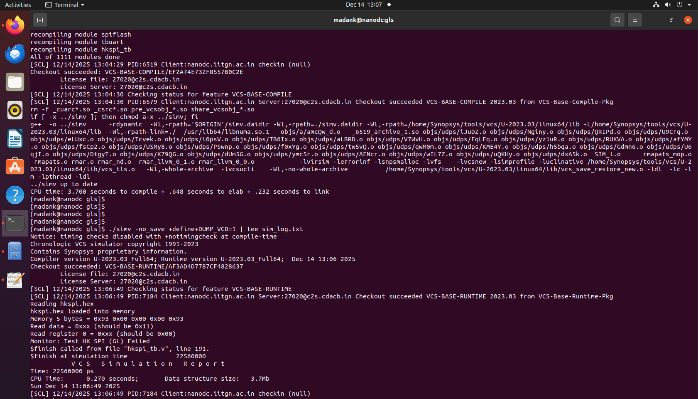

The output initially fails, producing unknown values. This behavior is expected because memory and POR modules were blackboxed during synthesis, resulting in undefined behavior during simulation.

To validate correct functionality, the blackbox definitions are removed and the original RTL implementations of these modules are included during gate-level simulation. The simulation is then recompiled and executed.


```
./simv -no_save +define+DUMP_VCD=1 | tee sim_log.txt
```

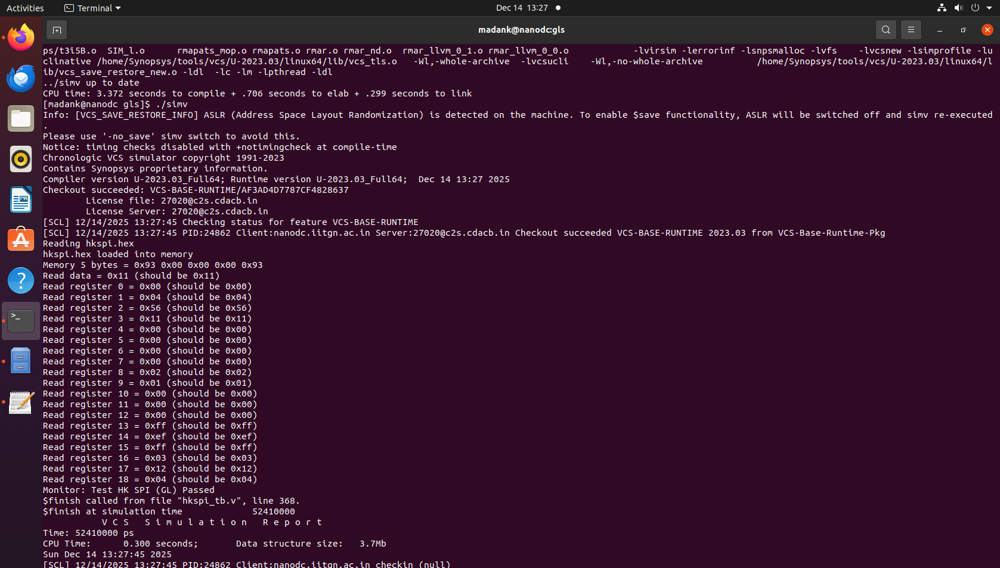

With the functional RTL of the memory and POR modules included, the gate-level simulation produces correct results that match the functional simulation.

Waveforms are again inspected using GTKWave.

```
gtkwave hkspi.vcd hkspi_tb.v
```

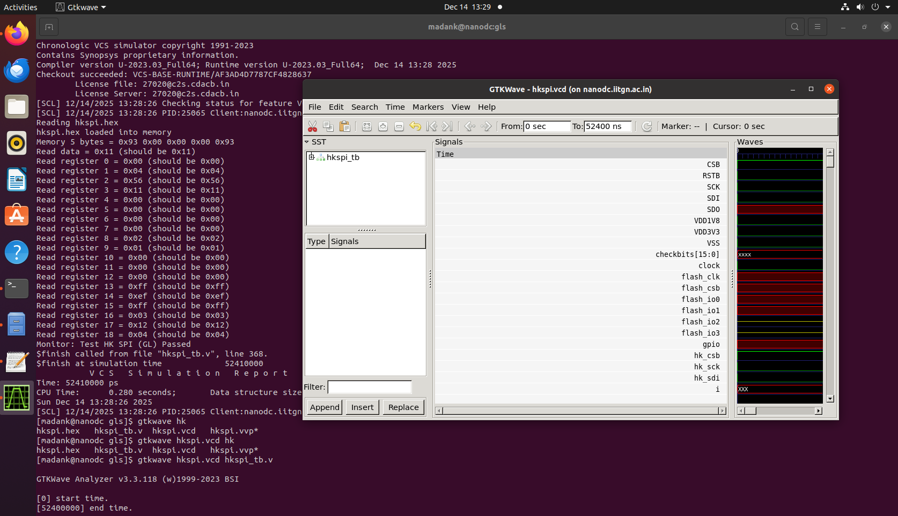


# Errors during gate-level simulation

A common error encountered during gate-level simulation is a port width mismatch. This occurs in the synthesized netlist where the mprj_io module instantiates the pc3b03_wrapper with multi-bit connections, while the wrapper module supports only single-bit ports.

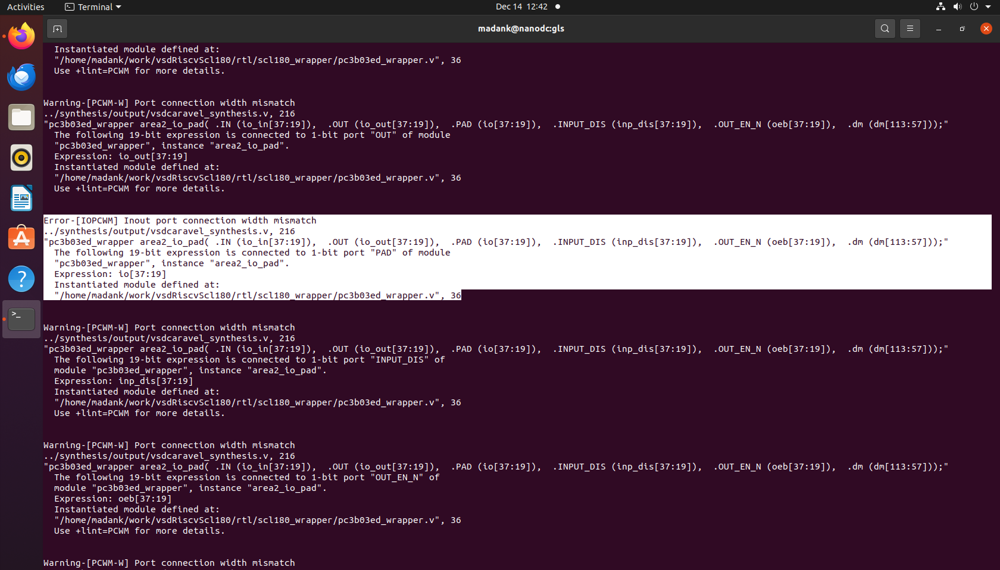

The pc3b03_wrapper definition shows that it is designed for single-bit operation.

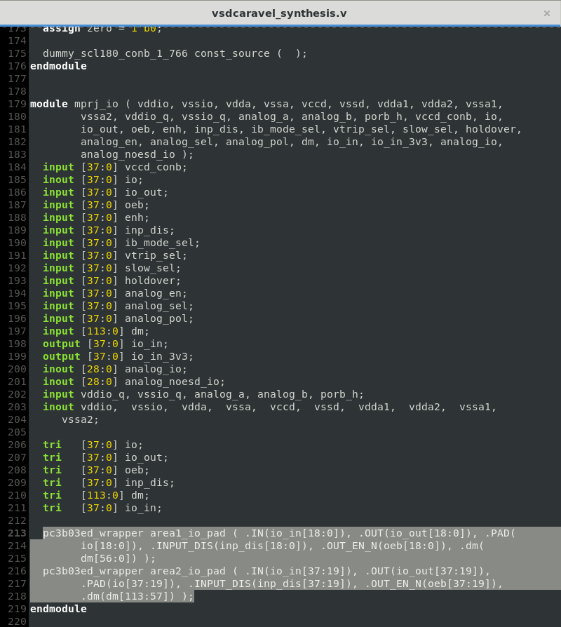

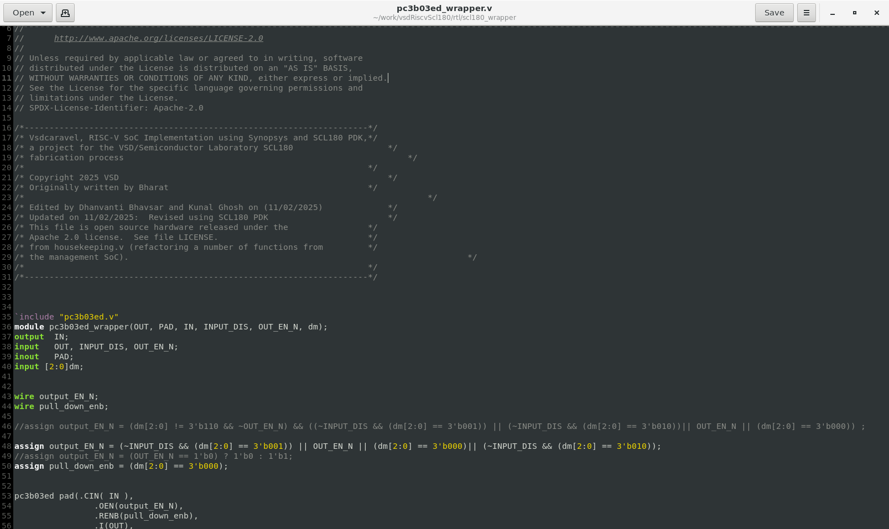

To resolve this issue, the pc3b03_wrapper module is instantiated multiple times, once for each bit of the multi-bit signal. A total of 38 instances are created to cover all input and output bits, eliminating the width mismatch and allowing the simulation to proceed successfully.


