# Task3 - Removal of On-Chip POR and Final GLS Validation (SCL-180)

The objective of this task is to formally remove the on-chip Power-On Reset (POR) from the VSD Caravel-based RISC-V SoC and to justify, through design reasoning, pad-level analysis, synthesis, and gate-level simulation, that an external reset-only strategy is safe and functionally correct for the SCL-180 technology.

This task demonstrates that POR is not a mandatory on-chip requirement when a robust external reset pad is available and correctly integrated into the design hierarchy.

## Removal of POR from RTL

The original design includes a dummy_por module, which generates internal power-on reset signals. Since the target flow relies entirely on an external reset pad, this module is no longer required.

The dummy_por instantiation is removed from caravel_core.v by commenting out or deleting the instance.


Once the POR generator is removed, its output signals must not remain floating. The signals porb_h and porb_l are therefore repurposed to be driven externally. In caravel_core, these signals are modified from output ports to inout ports so that they can be driven from the top-level module.


The same port-direction changes are reflected in the instantiation of caravel_core inside vsdcaravel.v to maintain port consistency and avoid elaboration mismatches.

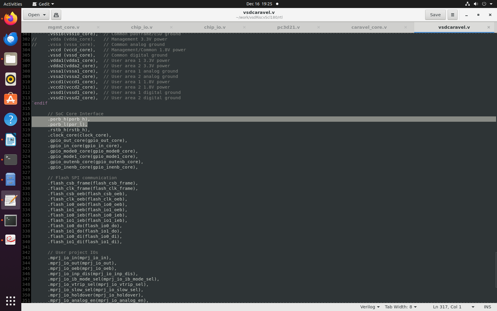

At the top level, the POR-related nets porb_h, porb_l, and por_l are explicitly tied to the external reset signal resetb. This ensures that all internal logic that previously depended on the POR now responds directly to the external reset pad.

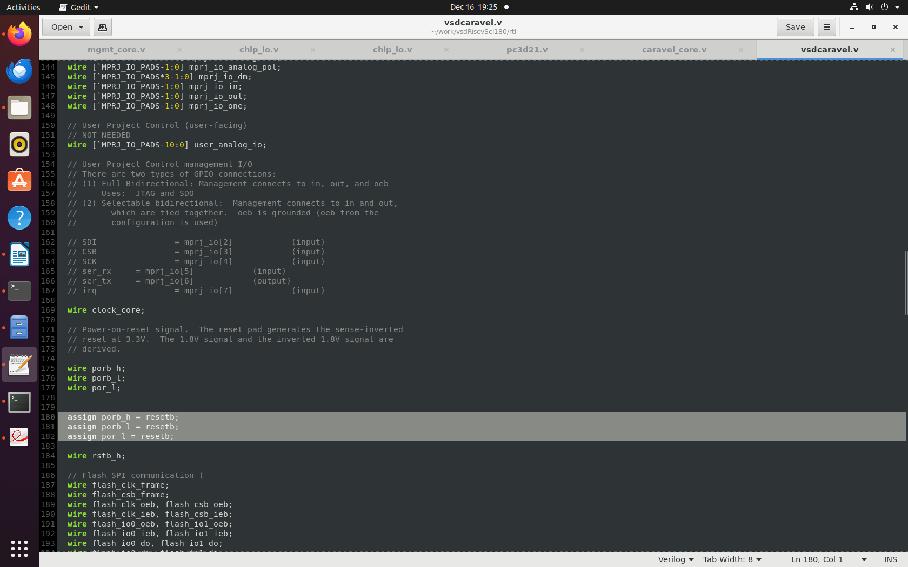

With these changes, the entire SoC reset behavior is controlled exclusively by the external reset pin.

## RTL (Functional) Simulation

Before running functional simulation, all remaining references to dummy_por are completely removed from the design hierarchy. The dummy_por.v files are deleted from both the rtl and gl directories.

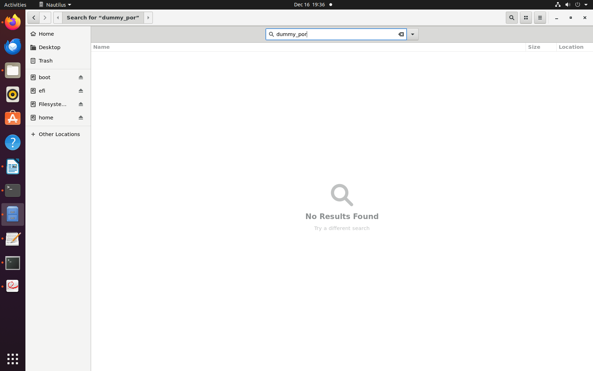

All include statements referencing dummy_por.v are also removed to prevent compilation errors.

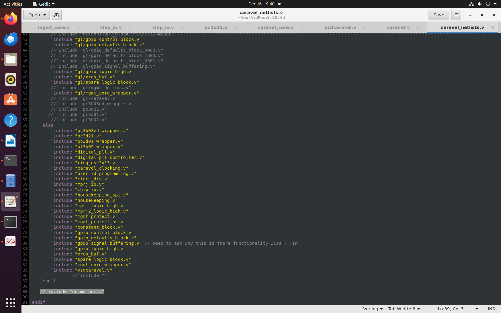

Functional simulation is performed using Synopsys VCS. The environment is initialized and the simulation is compiled with functional defines enabled.

The shell environment is set up as follows:

```
csh
source /home/madank/toolRC_iitgntapeout
```

The RTL simulation is compiled using the following VCS command:

```
vcs -full64 -sverilog -timescale=1ns/1ps -debug_access+all \
    +incdir+../ +incdir+../../rtl +incdir+../../rtl/scl180_wrapper \
    +incdir+/home/Synopsys/pdk/SCL_PDK_3/SCLPDK_V3.0_KIT/scl180/iopad/cio250/6M1L/verilog/tsl18cio250/zero \
    +define+FUNCTIONAL +define+SIM \
    hkspi_tb.v -o simv
```

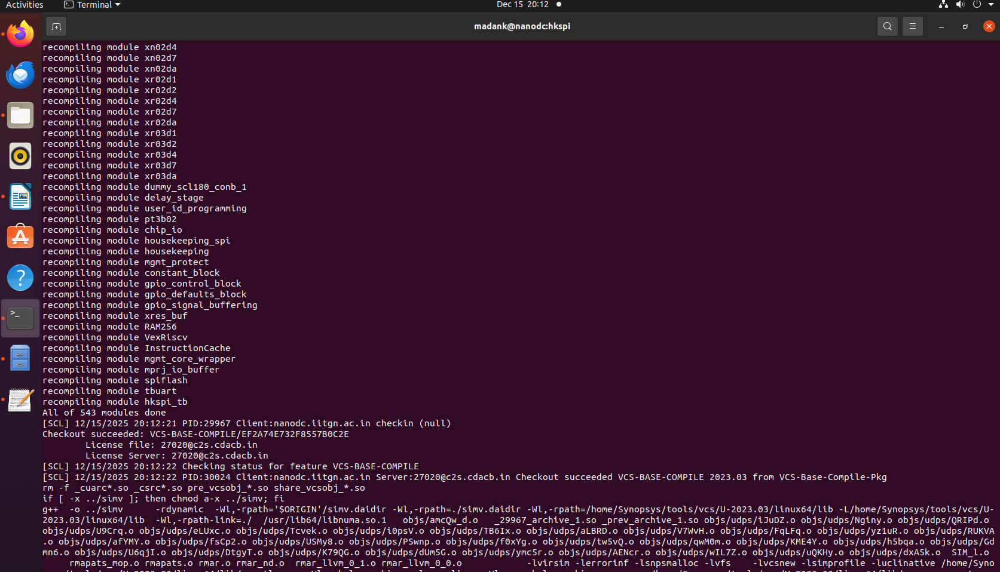

The simulation runs successfully and generates a VCD file for waveform analysis.

The compiled simulation is executed using:

```
./simv -no_save +define+DUMP_VCD=1 | tee sim_log.txt
```

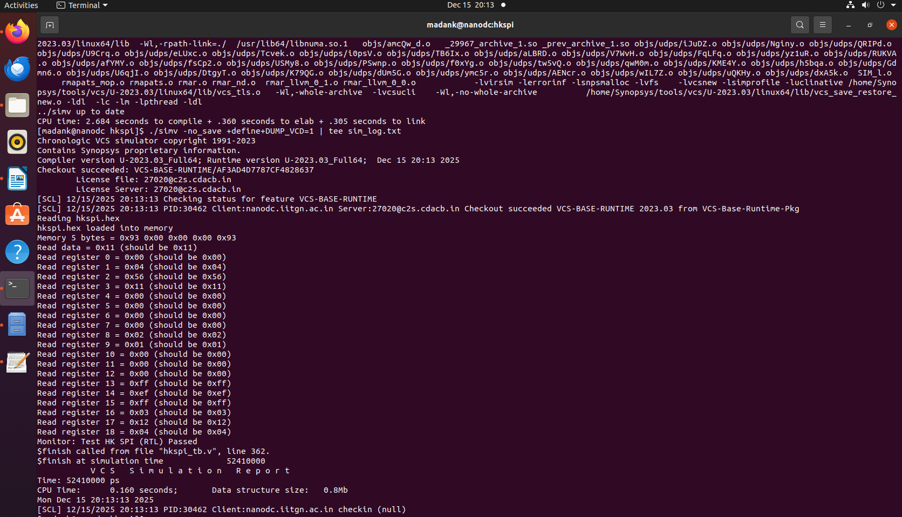

The simulation output confirms that all architectural registers and peripheral registers settle to their expected values, indicating correct functional behavior without the on-chip POR.

The waveform is examined using GTKWave.

```
gtkwave hkspi.vcd
```

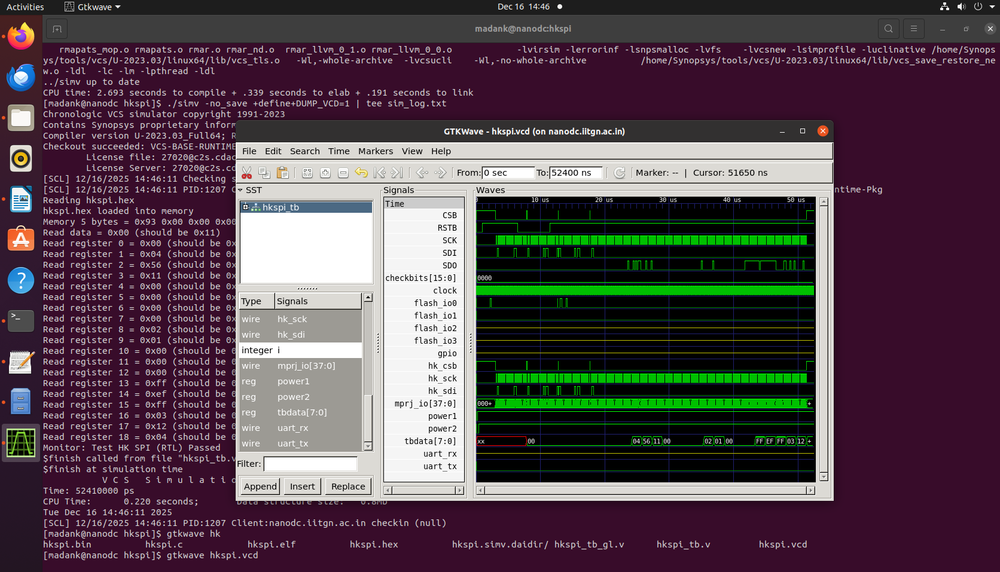


No unknown (X) propagation is observed in the reset or data paths.

To further validate reset behavior, additional logic is added in the testbench to reassert and deassert resetb during simulation using a fork–join_none construct.

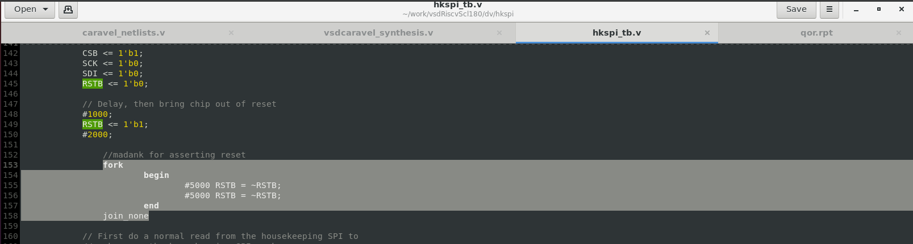

After rerunning the simulation, the waveform clearly shows that all registers and peripherals return to their default states when reset is asserted.


### External Reset Validation at RTL

| Before: No reset assertion | After: External reset asserted |
| :------------------------: | :----------------------------: |
|   |       |

This confirms that an external reset-only scheme is sufficient at the RTL level.

## Synthesis

Synthesis of the POR-free vsdcaravel SoC is performed using Synopsys Design Compiler in topographical mode. The flow uses compile_ultra with timing-aware optimization.

The synthesis script reads the SCL-180 IO pad libraries and standard cell libraries in Liberty DB format. The top module is vsdcaravel, and the generated gate-level netlist is written to the synthesis/output directory.

Memory macros such as RAM128 and RAM256 are intentionally treated as blackboxes to avoid technology-dependent implementations. Corresponding stub modules are provided.

The synthesis completes successfully, and inspection of the netlist confirms that dummy_por is not present anywhere in the design hierarchy.

Area, power, timing, and QoR reports are generated. The unresolved references reported correspond only to intentionally blackboxed modules and IO wrappers, and do not affect functional correctness.

The absence of POR logic in the synthesized netlist further validates that reset control is entirely external.

## Gate-Level Simulation (GLS)

Gate-level simulation is performed using the synthesized netlist to verify post-synthesis functional equivalence. VCS is used again with timing checks disabled for functional validation.

The gate-level simulation is compiled using the following VCS command:

```
vcs -full64 -sverilog -timescale=1ns/1ps \
    -debug_access+all \
    +define+FUNCTIONAL+SIM+GL \
    +notimingchecks \
    hkspi_tb.v \
    +incdir+../synthesis/output \
    +incdir+/home/Synopsys/pdk/SCL_PDK_3/SCLPDK_V3.0_KIT/scl180/iopad/cio250/4M1L/verilog/tsl18cio250/zero \
    +incdir+/home/Synopsys/pdk/SCL_PDK_3/SCLPDK_V3.0_KIT/scl180/stdcell/fs120/4M1IL/verilog/vcs_sim_model \
    -o simv
```

Initial GLS runs produce unknown values due to blackboxed memory macros, which is expected behavior. To obtain meaningful functional results, the RTL implementations of the memory modules are reintroduced during GLS compilation, replacing the blackbox stubs. 

After recompilation, the gate-level simulation produces correct outputs that match the RTL simulation.

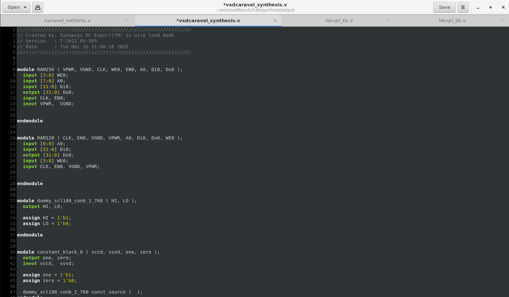

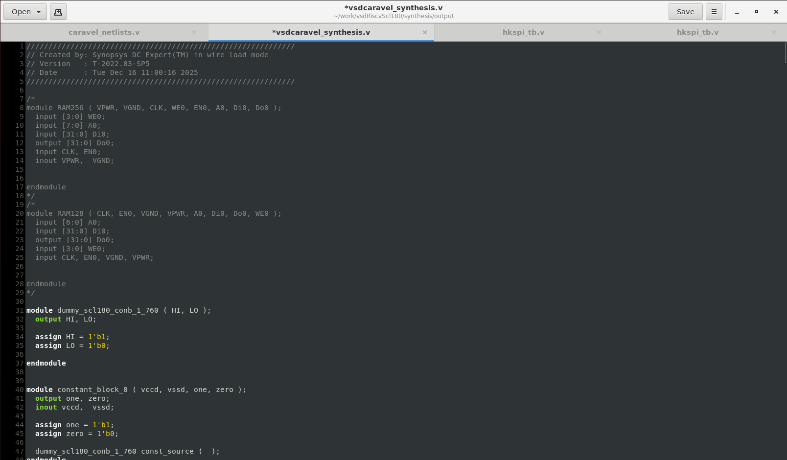

The compiled gate-level simulation is executed using:

```
./simv -no_save +define+DUMP_VCD=1 | tee sim_log.txt
```


Waveforms are examined in GTKWave.

```
gtkwave hkspi.vcd
```

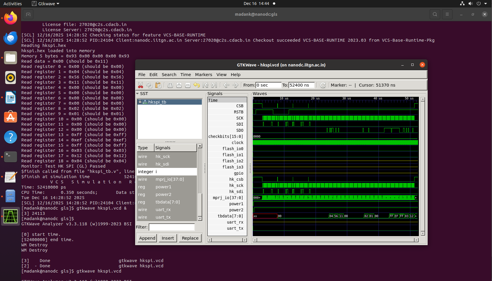

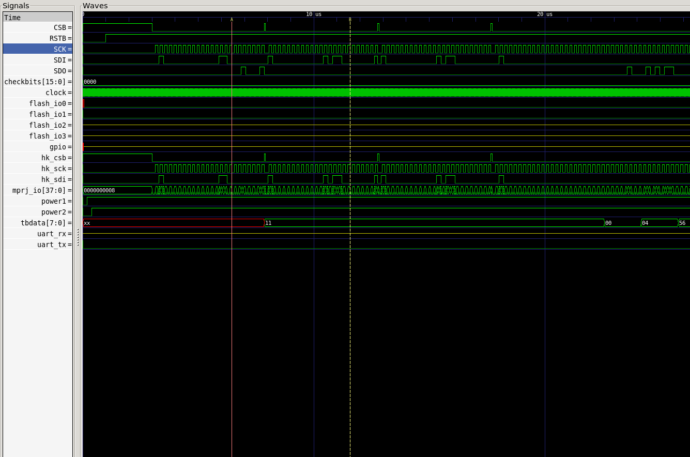

No X-propagation is observed, confirming clean reset and data behavior at the gate level.

The reset is asserted again from the testbench to confirm correct reset recovery behavior in the synthesized netlist.

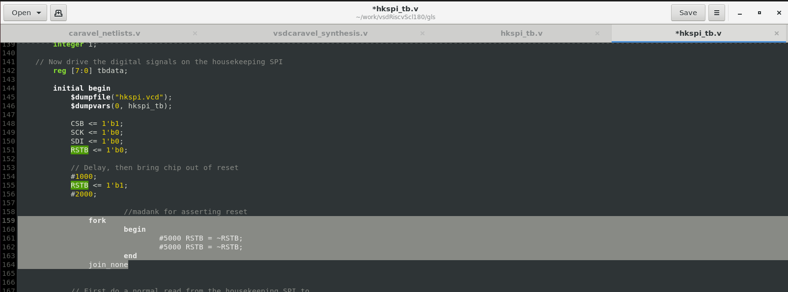

After re-running the simulation, peripheral outputs are observed to return to their default states when resetb is low. For example, the housekeeping SPI output SDO is driven low during reset.

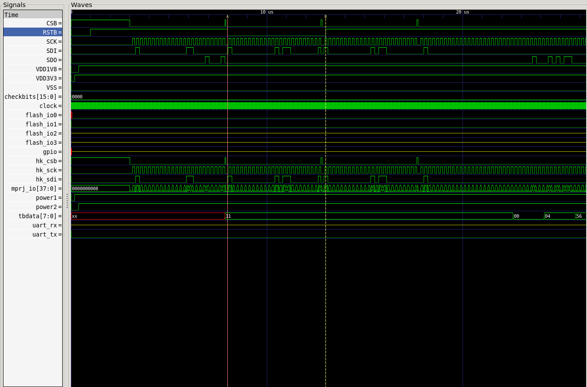

### External Reset Validation at GLS

| Before: No reset assertion | After: External reset asserted |
| :------------------------: | :----------------------------: |
|  |      |

## Conclusion

The complete removal of the on-chip POR and the successful validation across RTL simulation, synthesis, and gate-level simulation conclusively demonstrate that an external reset-only architecture is safe and correct for the SCL-180-based VSD Caravel SoC.

The reset pad is available immediately after VDD stabilization, behaves asynchronously, and provides sufficient coverage to initialize all internal logic without requiring an internal POR circuit. This approach simplifies the design, avoids redundant reset logic, and remains fully compliant with functional and synthesis requirements.
