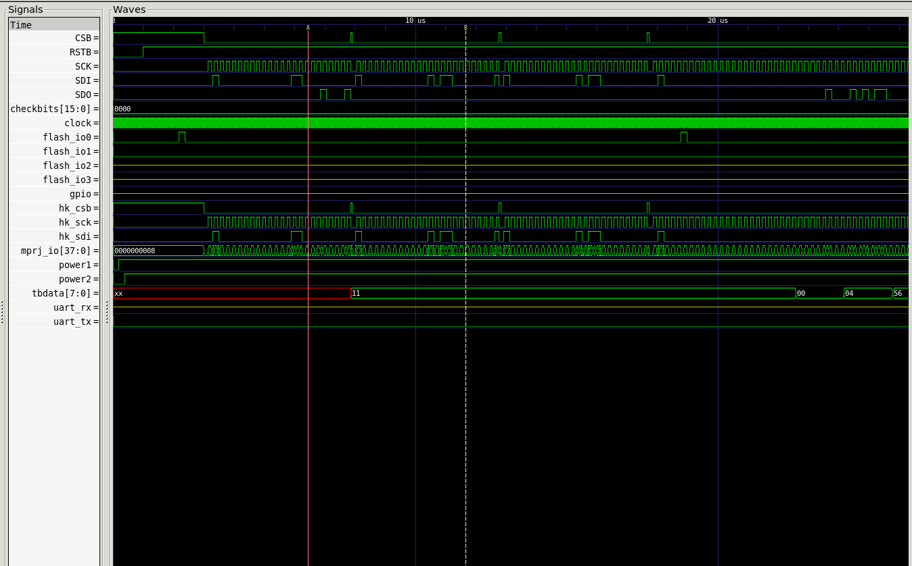
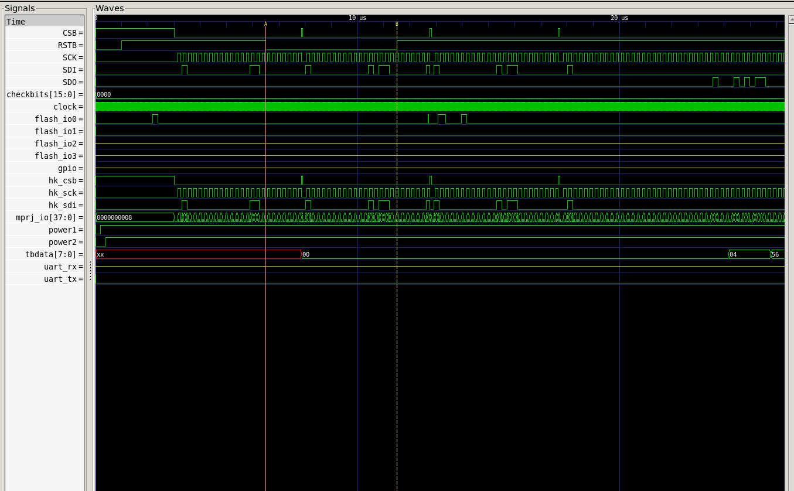

# Task3 - Removal of On-Chip POR and Final GLS Validation (SCL-180)

The objective of this task is to formally remove the on-chip Power-On Reset (POR) from the VSD Caravel-based RISC-V SoC and prove—using design reasoning, pad analysis, synthesis, and gate-level simulation—that an external reset-only strategy is safe and correct for SCL-180.

## Remove POR from RTL

First let us remove the dummy_por from our design. for that , lets remove (or comment) its instantiattion from the design. it is instantited in caravel_core.v

<fix1>

since the ports of dummy_por shouldnt be left hanging, we are going to use it in such a way it is driven by an external reset resetb.

So, in caravel_core Declare the output ports porb_h, porb_l as inout, so that we can drive those signals in the top module vsdcaravel.v 

<fix2>

Also remeber to do the same in the instantiation of the caravel_core (inside vsdcaravel.v), to avoid signal name mismatch.

<fix3>

Now assign the nets from the port porb_l, porh_l and por_l to resetb. This is done to provide an external reset to all the modules instead of dummy_por's por signal.

<fix4>

## RTL (Functional) simulation

Before running our RTL SImulation , let us make sure the dummy_por is totally removed from our design. let us delete all the dummy_por.v files from our design (both from rtl/ and gl/).

<fix5>

ALso, let us remove all the lines which includes the dummy_por.v 

<fix6>

Now let us Run the Simulation using VCS. Set the environment.


```
csh
source /home/madank/toolRC_iitgntapeout
```

Then run the simulation.

```
vcs -full64 -sverilog -timescale=1ns/1ps -debug_access+all \
    +incdir+../ +incdir+../../rtl +incdir+../../rtl/scl180_wrapper \
    +incdir+/home/Synopsys/pdk/SCL_PDK_3/SCLPDK_V3.0_KIT/scl180/iopad/cio250/6M1L/verilog/tsl18cio250/zero \
    +define+FUNCTIONAL +define+SIM \
    hkspi_tb.v -o simv
```

<5>

The simulation is executed and a VCD file is generated for waveform viewing.

```
./simv -no_save +define+DUMP_VCD=1 | tee sim_log.txt
```

<6>

the values of all the registers in the output shown above matched the expected values. so the design is functioonally correcct.

Now let us see the waveform:

```
gtkwave hkspi.vcd hkspi_tb.v
```

<7>

<8>

As we can see, the signals are propagating without any 'x'. 

Let us assert the reset and check if the values of registers and peripherals go back to default state. For that, i have added another logic in the testbench where the reset is asserted again and deasserted using a fork join_none block.

<10>

Now when we run the simulation again using VCS and view the waveform in gtkwave:

<9>

### Check if external reset works

|             Before: No reset assertion in tb           |      After: Reset is asserted in tb                 |
| :------------------------------------: | :------------------------------------------: |
|  |  |


## Synthesis

Synthesis of the vsdcaravel SoC without dummy_por is performed using Synopsys Design Compiler in topographical mode. The synthesis flow uses compile_ultra with incremental optimization to generate a timing-aware gate-level netlist.

The synthesis is run from the synthesis/work_folder directory using a TCL script located in the synthesis directory. This script reads the required standard cell and IO pad libraries, applies constraints, blackboxes selected modules, and generates reports.

The libraries used include SCL180 IO pad libraries and standard cell libraries in liberty DB format. The top module for synthesis is vsdcaravel, and the synthesized netlist is written to the synthesis/output directory.

Memory modules (RAM128, RAM256) are intentionally treated as blackboxes during synthesis to avoid implementation-specific dependencies. Corresponding blackbox module definitions are placed in the stubs directory.

Used this synth.tcl file for synthesis:

```tcl
read_db "/home/Synopsys/pdk/SCL_PDK_3/SCLPDK_V3.0_KIT/scl180/iopad/cio250/4M1L/liberty/tsl18cio250_min.db"

read_db "/home/Synopsys/pdk/SCL_PDK_3/SCLPDK_V3.0_KIT/scl180/stdcell/fs120/4M1IL/liberty/lib_flow_ff/tsl18fs120_scl_ff.db"


set target_library "/home/Synopsys/pdk/SCL_PDK_3/SCLPDK_V3.0_KIT/scl180/iopad/cio250/4M1L/liberty/tsl18cio250_min.db /home/Synopsys/pdk/SCL_PDK_3/SCLPDK_V3.0_KIT/scl180/stdcell/fs120/4M1IL/liberty/lib_flow_ff/tsl18fs120_scl_ff.db"

set link_library {"* /home/Synopsys/pdk/SCL_PDK_3/SCLPDK_V3.0_KIT/scl180/iopad/cio250/4M1L/liberty/tsl18cio250_min.db /home/Synopsys/pdk/SCL_PDK_3/SCLPDK_V3.0_KIT/scl180/stdcell/fs120/4M1IL/liberty/lib_flow_ff/tsl18fs120_scl_ff.db"}

set_app_var target_library $target_library
set_app_var link_library $link_library


set root_dir "/home/madank/work/vsdRiscvScl180"
set io_lib "/home/Synopsys/pdk/SCL_PDK_3/SCLPDK_V3.0_KIT/scl180/iopad/cio250/4M1L/verilog/tsl18cio250/zero"
set verilog_files  "$root_dir/rtl"
set top_module "vsdcaravel" ;
set output_file "$root_dir/synthesis/output/vsdcaravel_synthesis.v"
set report_dir "$root_dir/synthesis/report"

read_file $verilog_files/defines.v

set blackboxes_dir "/home/madank/work/vsdRiscvScl180/stubs"

set blackbox_files [glob -nocomplain ${blackboxes_dir}/*.v]

read_file $blackbox_files -format verilog


# read all rtl files
set all_rtl_files [glob -nocomplain ${verilog_files}/*.v]


# all rtl files except the blackbox ones
set files_to_read [list]

foreach file $all_rtl_files {
	set indicator 0
	foreach bb_file $blackbox_files {
		if {[string equal $file $bb_file]} {
		    set indicator 1
		    break
		}
	}
	if{!indicator}{
		lappend files_to_read $file
	}
}

read_file $files_to_read -define USE_POWER_PINS -format verilog

elaborate $top_module


# Mark RAM128 as blackbox
if {[sizeof_collection [get_designs -quiet RAM128]] > 0} {
    set_attribute [get_designs RAM128] is_black_box true -quiet
    set_dont_touch [get_designs RAM128]
}

# Mark RAM256 as blackbox
if {[sizeof_collection [get_designs -quiet RAM256]] > 0} {
    set_attribute [get_designs RAM256] is_black_box true -quiet
    set_dont_touch [get_designs RAM256]
}


# Mark dummy_por as blackbox
if {[sizeof_collection [get_designs -quiet dummy_por]] > 0} {
    set_attribute [get_designs dummy_por] is_black_box true -quiet
    set_dont_touch [get_designs dummy_por]
}


# Handle any other POR-related modules (case insensitive)
foreach_in_collection por_design [get_designs -quiet "*por*"] {
    set design_name [get_object_name $por_design]
    if {![string equal $design_name "dummy_por"]} {
        set_dont_touch $por_design
        set_attribute $por_design is_black_box true -quiet
    }
}


# Protect all instances of RAM128, RAM256, and dummy_por
foreach blackbox_ref {"RAM128" "RAM256" "dummy_por"} {
    set instances [get_cells -quiet -hierarchical -filter "ref_name == $blackbox_ref"]
    if {[sizeof_collection $instances] > 0} {
        set_dont_touch $instances
        set inst_count [sizeof_collection $instances]
    }
}


link

uniquify

read_sdc "$root_dir/synthesis/vsdcaravel.sdc"

compile

write -format verilog -hierarchy -output $output_file
write -format ddc -hierarchy -output "$root_dir/synthesis/output/vsdcaravel_synthesis.ddc"
write_sdc "$root_dir/synthesis/output/vsdcaravel_synthesis.sdc"


report_area > "$report_dir/area.rpt"
report_power > "$report_dir/power.rpt"
report_timing -max_paths 10 > "$report_dir/timing.rpt"
report_constraint -all_violators > "$report_dir/constraints.rpt"
report_qor > "$report_dir/qor.rpt"
```

Synthesis is launched using dc_shell.

```
dc_shell -f ../synth.tcl
```

The synthesized netlist is generated successfully and stored in the synthesis/output directory. Inspection of the netlist confirms that the POR module is not synthesized or used anywhere in the design. Also, the RAM modules are blackboxed successfully.

Area report:

```
Warning: Design 'vsdcaravel' has '4' unresolved references. For more detailed information, use the "link" command. (UID-341)
 
****************************************
Report : area
Design : vsdcaravel
Version: T-2022.03-SP5
Date   : Tue Dec 16 10:52:38 2025
****************************************

Library(s) Used:

    tsl18fs120_scl_ff (File: /home/Synopsys/pdk/SCL_PDK_3/SCLPDK_V3.0_KIT/scl180/stdcell/fs120/4M1IL/liberty/lib_flow_ff/tsl18fs120_scl_ff.db)
    tsl18cio250_min (File: /home/Synopsys/pdk/SCL_PDK_3/SCLPDK_V3.0_KIT/scl180/iopad/cio250/4M1L/liberty/tsl18cio250_min.db)

Number of ports:                        14246
Number of nets:                         38523
Number of cells:                        31047
Number of combinational cells:          18422
Number of sequential cells:              6888
Number of macros/black boxes:              17
Number of buf/inv:                       3532
Number of references:                       2

Combinational area:             341951.960055
Buf/Inv area:                    28798.119889
Noncombinational area:          431036.399128
Macro/Black Box area:             1395.760063
Net Interconnect area:           32654.899591

Total cell area:                774384.119246
Total area:                     807039.018838

Information: This design contains black box (unknown) components. (RPT-8)
1
```

Power report:

```
Global Operating Voltage = 1.98 
Power-specific unit information :
    Voltage Units = 1V
    Capacitance Units = 1.000000pf
    Time Units = 1ns
    Dynamic Power Units = 1mW    (derived from V,C,T units)
    Leakage Power Units = 1pW


Attributes
----------
i - Including register clock pin internal power


  Cell Internal Power  =  38.4103 mW   (55%)
  Net Switching Power  =  31.6868 mW   (45%)
                         ---------
Total Dynamic Power    =  70.0971 mW  (100%)

Cell Leakage Power     =   1.1350 uW

Information: report_power power group summary does not include estimated clock tree power. (PWR-789)

                 Internal         Switching           Leakage            Total
Power Group      Power            Power               Power              Power   (   %    )  Attrs
--------------------------------------------------------------------------------------------------
io_pad             1.7098        3.4965e-03        5.7237e+03            1.7133  (   2.45%)
memory             0.0000            0.0000            0.0000            0.0000  (   0.00%)
black_box          0.0000            0.1470           62.7200            0.1470  (   0.21%)
clock_network      0.0000            0.0000            0.0000            0.0000  (   0.00%)  i
register           0.0000            0.0000            0.0000            0.0000  (   0.00%)
sequential        33.1555            0.2874        7.1946e+05           33.4438  (  47.73%)
combinational      3.5455           31.2169        4.0971e+05           34.7625  (  49.61%)
--------------------------------------------------------------------------------------------------
Total             38.4108 mW        31.6548 mW     1.1350e+06 pW        70.0666 mW
1
```

QOR Report:

```
Information: Building the design 'pc3d01_wrapper'. (HDL-193)
Error:  Source file for 'pc3d01_wrapper' was not analyzed by this release of the compiler; re-analyze it. (ELAB-343)
*** Presto compilation terminated with 1 errors. ***
Information: Building the design 'pc3b03ed_wrapper'. (HDL-193)
Error:  Source file for 'pc3b03ed_wrapper' was not analyzed by this release of the compiler; re-analyze it. (ELAB-343)
*** Presto compilation terminated with 1 errors. ***
Information: Building the design 'pt3b02_wrapper'. (HDL-193)
Error:  Source file for 'pt3b02_wrapper' was not analyzed by this release of the compiler; re-analyze it. (ELAB-343)
*** Presto compilation terminated with 1 errors. ***
Warning: Unable to resolve reference 'pc3d01_wrapper' in 'chip_io'. (LINK-5)
Warning: Unable to resolve reference 'pc3b03ed_wrapper' in 'chip_io'. (LINK-5)
Warning: Unable to resolve reference 'pt3b02_wrapper' in 'chip_io'. (LINK-5)
Warning: Unable to resolve reference 'pc3b03ed_wrapper' in 'mprj_io'. (LINK-5)
Information: Updating design information... (UID-85)
Information: Timing loop detected. (OPT-150)
	chip_core/housekeeping/U223/I chip_core/housekeeping/U223/Z chip_core/housekeeping/U194/I chip_core/housekeeping/U194/Z chip_core/housekeeping/wbbd_sck_reg/CP chip_core/housekeeping/wbbd_sck_reg/QN chip_core/housekeeping/U3071/I chip_core/housekeeping/U3071/ZN chip_core/housekeeping/U3066/I0 chip_core/housekeeping/U3066/Z chip_core/housekeeping/U236/I chip_core/housekeeping/U236/Z chip_core/housekeeping/U233/I chip_core/housekeeping/U233/Z chip_core/housekeeping/U220/I chip_core/housekeeping/U220/Z chip_core/housekeeping/U187/I chip_core/housekeeping/U187/Z chip_core/housekeeping/pll_ena_reg/CP chip_core/housekeeping/pll_ena_reg/Q chip_core/pll/U29/A2 chip_core/pll/U29/ZN chip_core/pll/ringosc/iss/U4/I chip_core/pll/ringosc/iss/U4/ZN chip_core/pll/ringosc/iss/reseten0/EN chip_core/pll/ringosc/iss/reseten0/ZN chip_core/pll/pll_control/tval_reg[6]/CP chip_core/pll/pll_control/tval_reg[6]/Q chip_core/pll/pll_control/U122/I chip_core/pll/pll_control/U122/ZN chip_core/pll/pll_control/U29/A chip_core/pll/pll_control/U29/ZN chip_core/pll/pll_control/U28/A chip_core/pll/pll_control/U28/ZN chip_core/pll/pll_control/U27/A chip_core/pll/pll_control/U27/ZN chip_core/pll/pll_control/U26/A1 chip_core/pll/pll_control/U26/ZN chip_core/pll/pll_control/U25/A chip_core/pll/pll_control/U25/ZN chip_core/pll/pll_control/U22/A1 chip_core/pll/pll_control/U22/ZN chip_core/pll/pll_control/U21/A chip_core/pll/pll_control/U21/ZN chip_core/pll/pll_control/U7/I chip_core/pll/pll_control/U7/ZN chip_core/pll/U7/I0 chip_core/pll/U7/Z chip_core/pll/ringosc/dstage[5].id/U1/I chip_core/pll/ringosc/dstage[5].id/U1/ZN chip_core/pll/ringosc/dstage[5].id/delayen0/EN chip_core/pll/ringosc/dstage[5].id/delayen0/ZN chip_core/clock_ctrl/ext_clk_syncd_reg/CP chip_core/clock_ctrl/ext_clk_syncd_reg/Q chip_core/clock_ctrl/U9/I1 chip_core/clock_ctrl/U9/Z chip_core/clock_ctrl/U8/I0 chip_core/clock_ctrl/U8/Z chip_core/U1/I chip_core/U1/Z 
Information: Timing loop detected. (OPT-150)
	chip_core/housekeeping/U219/I chip_core/housekeeping/U219/Z chip_core/housekeeping/U185/I chip_core/housekeeping/U185/Z chip_core/housekeeping/gpio_configure_reg[3][3]/CP chip_core/housekeeping/gpio_configure_reg[3][3]/Q chip_core/housekeeping/U3072/A1 chip_core/housekeeping/U3072/ZN chip_core/housekeeping/U3068/A1 chip_core/housekeeping/U3068/ZN chip_core/housekeeping/U3067/A2 chip_core/housekeeping/U3067/ZN chip_core/housekeeping/U3066/I1 chip_core/housekeeping/U3066/Z chip_core/housekeeping/U236/I chip_core/housekeeping/U236/Z chip_core/housekeeping/U233/I chip_core/housekeeping/U233/Z 
Warning: Disabling timing arc between pins 'CP' and 'Q' on cell 'chip_core/pll/pll_control/tval_reg[6]'
         to break a timing loop. (OPT-314)
Warning: Disabling timing arc between pins 'CP' and 'Q' on cell 'chip_core/housekeeping/gpio_configure_reg[3][3]'
         to break a timing loop. (OPT-314)
Warning: Disabling timing arc between pins 'CP' and 'Q' on cell 'chip_core/housekeeping/hkspi_disable_reg'
         to break a timing loop. (OPT-314)
Warning: Disabling timing arc between pins 'CP' and 'Q' on cell 'chip_core/pll/pll_control/tval_reg[4]'
         to break a timing loop. (OPT-314)
Warning: Disabling timing arc between pins 'CP' and 'Q' on cell 'chip_core/pll/pll_control/tval_reg[3]'
         to break a timing loop. (OPT-314)
Warning: Disabling timing arc between pins 'CP' and 'Q' on cell 'chip_core/pll/pll_control/tval_reg[2]'
         to break a timing loop. (OPT-314)
Warning: Disabling timing arc between pins 'CP' and 'Q' on cell 'chip_core/pll/pll_control/tval_reg[5]'
         to break a timing loop. (OPT-314)
Warning: Disabling timing arc between pins 'I' and 'ZN' on cell 'chip_core/pll/ringosc/dstage[0].id/delayenb1'
         to break a timing loop. (OPT-314)
Warning: Disabling timing arc between pins 'I' and 'ZN' on cell 'chip_core/pll/ringosc/dstage[0].id/delayen1'
         to break a timing loop. (OPT-314)
Warning: Disabling timing arc between pins 'I' and 'ZN' on cell 'chip_core/pll/ringosc/dstage[0].id/delayenb0'
         to break a timing loop. (OPT-314)
Warning: Disabling timing arc between pins 'CP' and 'Q' on cell 'chip_core/clock_ctrl/divider/syncN_reg[1]'
         to break a timing loop. (OPT-314)
Warning: Disabling timing arc between pins 'CP' and 'QN' on cell 'chip_core/clock_ctrl/divider/syncN_reg[1]'
         to break a timing loop. (OPT-314)
Warning: Disabling timing arc between pins 'CP' and 'Q' on cell 'chip_core/clock_ctrl/divider/syncN_reg[2]'
         to break a timing loop. (OPT-314)
Warning: Disabling timing arc between pins 'CP' and 'Q' on cell 'chip_core/clock_ctrl/divider/syncN_reg[0]'
         to break a timing loop. (OPT-314)
Warning: Disabling timing arc between pins 'CP' and 'QN' on cell 'chip_core/housekeeping/wbbd_sck_reg'
         to break a timing loop. (OPT-314)
Warning: Disabling timing arc between pins 'CP' and 'QN' on cell 'chip_core/housekeeping/wbbd_busy_reg'
         to break a timing loop. (OPT-314)
Warning: Disabling timing arc between pins 'CP' and 'Q' on cell 'chip_core/clock_ctrl/divider2/syncN_reg[1]'
         to break a timing loop. (OPT-314)
Warning: Disabling timing arc between pins 'CP' and 'QN' on cell 'chip_core/clock_ctrl/divider2/syncN_reg[1]'
         to break a timing loop. (OPT-314)
Warning: Disabling timing arc between pins 'CP' and 'Q' on cell 'chip_core/clock_ctrl/divider2/syncN_reg[2]'
         to break a timing loop. (OPT-314)
Warning: Disabling timing arc between pins 'CP' and 'Q' on cell 'chip_core/clock_ctrl/divider2/syncN_reg[0]'
         to break a timing loop. (OPT-314)
 
****************************************
Report : qor
Design : vsdcaravel
Version: T-2022.03-SP5
Date   : Tue Dec 16 10:52:38 2025
****************************************


  Timing Path Group (none)
  -----------------------------------
  Levels of Logic:               0.00
  Critical Path Length:          0.00
  Critical Path Slack:         uninit
  Critical Path Clk Period:       n/a
  Total Negative Slack:          0.00
  No. of Violating Paths:        0.00
  Worst Hold Violation:          0.00
  Total Hold Violation:          0.00
  No. of Hold Violations:        0.00
  -----------------------------------


  Cell Count
  -----------------------------------
  Hierarchical Cell Count:       1451
  Hierarchical Port Count:      14183
  Leaf Cell Count:              25327
  Buf/Inv Cell Count:            3532
  Buf Cell Count:                 456
  Inv Cell Count:                3081
  CT Buf/Inv Cell Count:            0
  Combinational Cell Count:     18503
  Sequential Cell Count:         6824
  Macro Count:                      0
  -----------------------------------


  Area
  -----------------------------------
  Combinational Area:   341951.960055
  Noncombinational Area:
                        431036.399128
  Buf/Inv Area:          28798.119889
  Total Buffer Area:          7393.23
  Total Inverter Area:       21734.19
  Macro/Black Box Area:   1395.760063
  Net Area:              32654.899591
  -----------------------------------
  Cell Area:            774384.119246
  Design Area:          807039.018838


  Design Rules
  -----------------------------------
  Total Number of Nets:         30094
  Nets With Violations:             0
  Max Trans Violations:             0
  Max Cap Violations:               0
  -----------------------------------


  Hostname: nanodc.iitgn.ac.in

  Compile CPU Statistics
  -----------------------------------------
  Resource Sharing:                   10.22
  Logic Optimization:                 11.38
  Mapping Optimization:                8.94
  -----------------------------------------
  Overall Compile Time:               34.90
  Overall Compile Wall Clock Time:    35.74

  --------------------------------------------------------------------

  Design  WNS: 0.00  TNS: 0.00  Number of Violating Paths: 0


  Design (Hold)  WNS: 0.00  TNS: 0.00  Number of Violating Paths: 0

  --------------------------------------------------------------------


1
```


