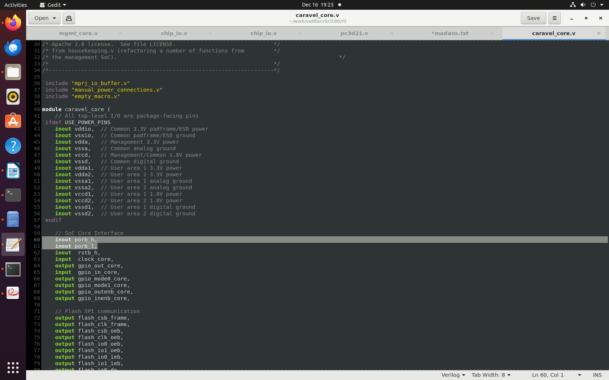
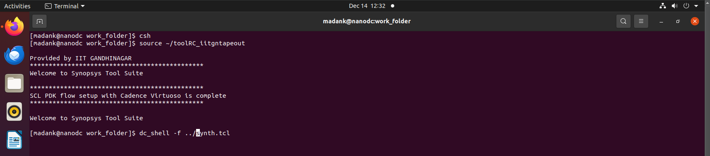
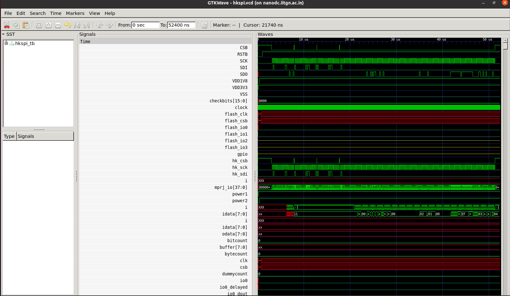
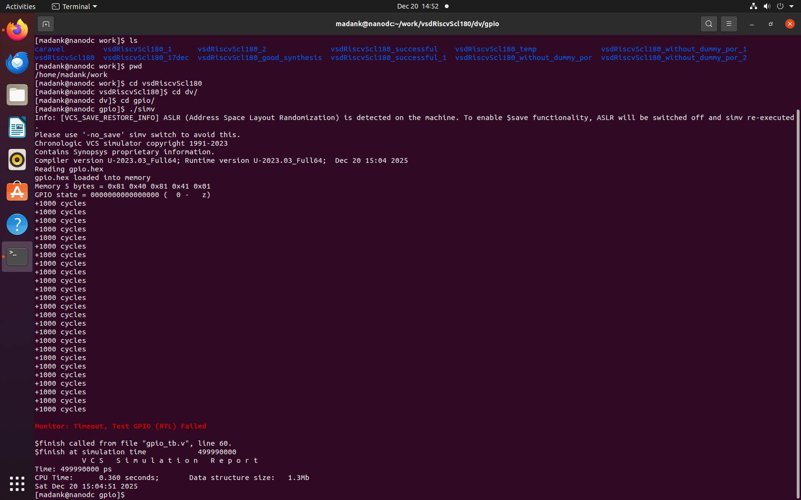
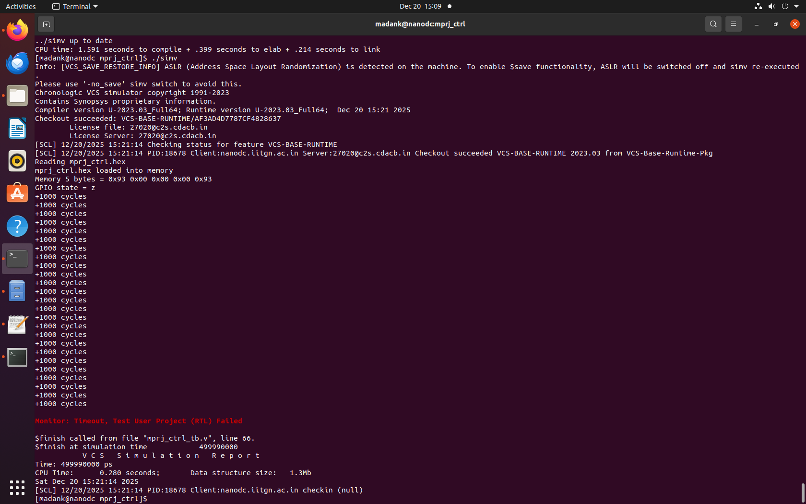
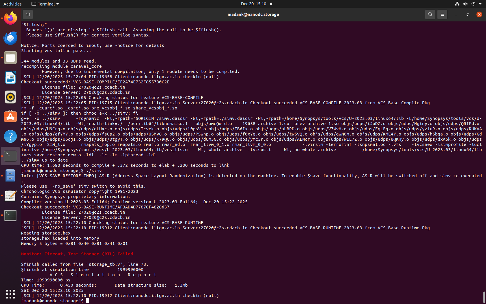
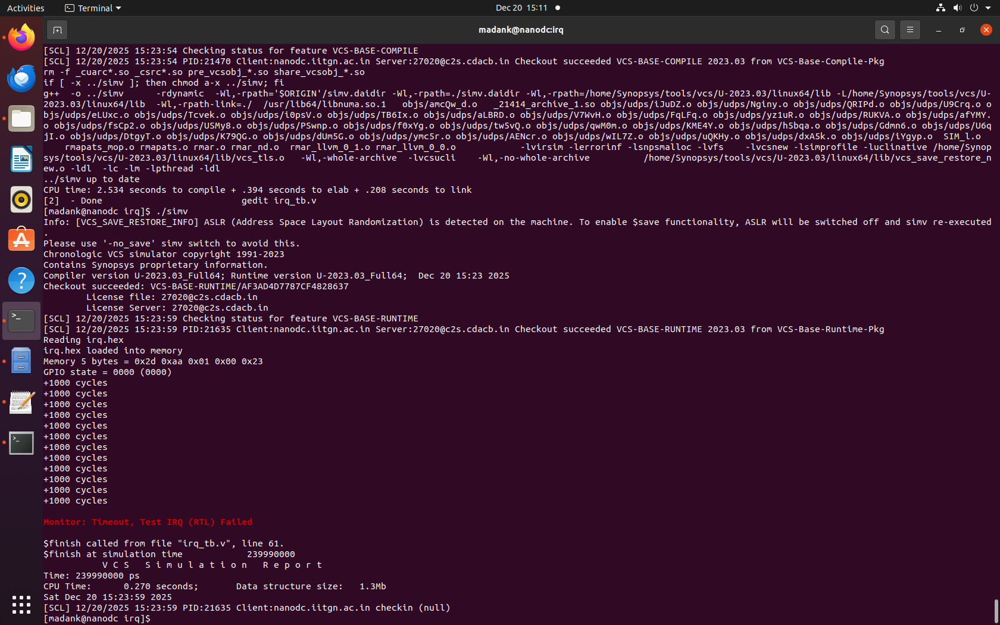

# Task4: Full Management SoC DV Validation on SCL-180 (POR-Free Design)

## Objective

The objective of this task is to demonstrate that the modified Management SoC RTL, with complete removal of internal Power-On Reset (POR) logic, is stable, reusable, and production-ready on the SCL-180 technology node. This validation is achieved by executing the complete set of Management SoC DV tests originally developed for the Caravel platform, without modifying the test intent or expected behavior.

The validation flow proves functional equivalence across multiple abstraction levels and memory implementations. The same DV tests are executed on pure RTL, on a synthesized netlist with RTL SRAM models, and on a synthesized netlist with DC_TOPO-compatible SRAM handling. Identical behavior across all runs confirms correctness of reset handling, synthesis assumptions, and simulation consistency.

---

## Toolchain Requirements

The following tools and libraries are required to reproduce this flow:

• Synopsys VCS for RTL and gate-level simulation
• Synopsys Design Compiler for synthesis
• SCL-180 standard cell libraries
• SCL-180 IO pad libraries and Verilog models

---

## RTL Preparation

### Removal of POR from RTL

The original Caravel-based design contains a `dummy_por` module that generates internal power-on reset signals. In the SCL-180 flow, reset functionality is expected to be driven entirely from an external reset pad. Therefore, the internal POR generator is redundant and must be removed.

The `dummy_por` instantiation is removed from `caravel_core.v` by deleting or commenting out the instance.


After removal, the POR output signals `porb_h` and `porb_l` must not be left floating. These signals are repurposed to be driven externally. To enable this, their direction in `caravel_core` is modified from output to inout.



The same port direction changes are reflected in the instantiation of `caravel_core` inside `vsdcaravel.v`. This ensures port consistency and avoids elaboration or linking errors during synthesis and simulation.


At the top level, all POR-related nets (`porb_h`, `porb_l`, and `por_l`) are explicitly tied to the external reset signal `resetb`. As a result, all internal logic that previously relied on POR now responds directly to the external reset pad.


With these changes, the entire SoC reset behavior is fully controlled by the external reset pin, eliminating any hidden or implicit reset sources.

---

## Synthesis Using DC_TOPO

Synthesis of the POR-free `vsdcaravel` SoC is performed using Synopsys Design Compiler. The synthesis flow is executed from the `synthesis/work_folder` directory using a dedicated TCL script.

The script performs the following actions:

• Reads SCL-180 standard cell and IO pad liberty databases
• Reads RTL source files
• Reads blackbox stubs for memory and POR-related modules
• Applies timing constraints
• Blackboxes SRAM and POR modules to avoid implementation dependency
• Generates synthesized netlist and reports

The top module for synthesis is `vsdcaravel`, and the generated netlist is written to the `synthesis/output` directory.

Memory modules (`RAM128`, `RAM256`) and POR-related logic (`dummy_por`) are intentionally treated as blackboxes during synthesis. This ensures synthesis proceeds without requiring foundry-specific SRAM implementations.


An example blackbox stub definition for the `dummy_por` module is shown below.


The following `synth.tcl` script is used for synthesis:

```tcl
read_db "/home/Synopsys/pdk/SCL_PDK_3/SCLPDK_V3.0_KIT/scl180/iopad/cio250/4M1L/liberty/tsl18cio250_min.db"

read_db "/home/Synopsys/pdk/SCL_PDK_3/SCLPDK_V3.0_KIT/scl180/stdcell/fs120/4M1IL/liberty/lib_flow_ff/tsl18fs120_scl_ff.db"

set target_library "/home/Synopsys/pdk/SCL_PDK_3/SCLPDK_V3.0_KIT/scl180/iopad/cio250/4M1L/liberty/tsl18cio250_min.db /home/Synopsys/pdk/SCL_PDK_3/SCLPDK_V3.0_KIT/scl180/stdcell/fs120/4M1IL/liberty/lib_flow_ff/tsl18fs120_scl_ff.db"

set link_library {"* /home/Synopsys/pdk/SCL_PDK_3/SCLPDK_V3.0_KIT/scl180/iopad/cio250/4M1L/liberty/tsl18cio250_min.db /home/Synopsys/pdk/SCL_PDK_3/SCLPDK_V3.0_KIT/scl180/stdcell/fs120/4M1IL/liberty/lib_flow_ff/tsl18fs120_scl_ff.db"}

set_app_var target_library $target_library
set_app_var link_library $link_library

set root_dir "/home/madank/work/vsdRiscvScl180"
set io_lib "/home/Synopsys/pdk/SCL_PDK_3/SCLPDK_V3.0_KIT/scl180/iopad/cio250/4M1L/verilog/tsl18cio250/zero"
set verilog_files  "$root_dir/rtl"
set top_module "vsdcaravel"
set output_file "$root_dir/synthesis/output/vsdcaravel_synthesis.v"
set report_dir "$root_dir/synthesis/report"

read_file $verilog_files/defines.v

set blackboxes_dir "/home/madank/work/vsdRiscvScl180/stubs"
set blackbox_files [glob -nocomplain ${blackboxes_dir}/*.v]
read_file $blackbox_files -format verilog

set all_rtl_files [glob -nocomplain ${verilog_files}/*.v]
set files_to_read [list]

foreach file $all_rtl_files {
	set indicator 0
	foreach bb_file $blackbox_files {
		if {[string equal $file $bb_file]} {
		    set indicator 1
		    break
		}
	}
	if {!indicator} {
		lappend files_to_read $file
	}
}

read_file $files_to_read -define USE_POWER_PINS -format verilog
elaborate $top_module

set_attribute [get_designs RAM128] is_black_box true -quiet
set_attribute [get_designs RAM256] is_black_box true -quiet
set_attribute [get_designs dummy_por] is_black_box true -quiet

link
uniquify

read_sdc "$root_dir/synthesis/vsdcaravel.sdc"
compile

write -format verilog -hierarchy -output $output_file
write -format ddc -hierarchy -output "$root_dir/synthesis/output/vsdcaravel_synthesis.ddc"
write_sdc "$root_dir/synthesis/output/vsdcaravel_synthesis.sdc"

report_area > "$report_dir/area.rpt"
report_power > "$report_dir/power.rpt"
report_timing -max_paths 10 > "$report_dir/timing.rpt"
report_constraint -all_violators > "$report_dir/constraints.rpt"
report_qor > "$report_dir/qor.rpt"
```

Synthesis is launched using:

```
dc_shell -f ../synth.tcl
```




The synthesized netlist is generated successfully and stored in the output directory.


Inspection of the netlist confirms that SRAM and POR modules are preserved as blackboxes. For GLS with RTL SRAM models, `RAM128.v` and `RAM256.v` are explicitly included during simulation.

---

## Management SoC DV – Run-1 (RTL SRAM)

### Housekeeping SPI – Functional Simulation

Functional simulation focuses on the `housekeeping_spi` block within the Management SoC. The corresponding testbench is located in the `dv/hkspi` directory.

```
cd dv/hkspi/
```

The Synopsys environment is initialized before invoking VCS.

```
csh
source /home/madank/toolRC_iitgntapeout
```

The following command compiles the RTL and testbench:

```
vcs -full64 -sverilog -timescale=1ns/1ps -debug_access+all \
    +incdir+../ +incdir+../../rtl +incdir+../../rtl/scl180_wrapper \
    +incdir+/home/Synopsys/pdk/SCL_PDK_3/SCLPDK_V3.0_KIT/scl180/iopad/cio250/6M1L/verilog/tsl18cio250/zero \
    +define+FUNCTIONAL +define+SIM \
    hkspi_tb.v -o simv
```

Simulation execution and VCD dump:

```
./simv -no_save +define+DUMP_VCD=1 | tee sim_log.txt
```


All housekeeping SPI test cases pass successfully. Registers 0 through 18 return expected values, confirming correct functional behavior.

Waveforms are inspected using GTKWave:

```
gtkwave hkspi.vcd hkspi_tb.v
```


---

## Gate-Level Simulation

Gate-level simulation validates post-synthesis behavior using the synthesized netlist.

```
vcs -full64 -sverilog -timescale=1ns/1ps \
    -debug_access+all \
    +define+FUNCTIONAL+SIM+GL \
    +notimingchecks \
    hkspi_tb.v \
    +incdir+../synthesis/output \
    +incdir+/home/Synopsys/pdk/SCL_PDK_3/SCLPDK_V3.0_KIT/scl180/iopad/cio250/4M1L/verilog/tsl18cio250/zero \
    +incdir+/home/Synopsys/pdk/SCL_PDK_3/SCLPDK_V3.0_KIT/scl180/stdcell/fs120/4M1IL/verilog/vcs_sim_model \
    -o simv
```


Simulation execution:

```
./simv -no_save +define+DUMP_VCD=1 | tee sim_log.txt
```


Initial failures with unknown values are expected due to blackboxed memory and POR logic. To resolve this, blackbox stubs are removed and the original RTL implementations of memory and POR modules are included.


```
./simv -no_save +define+DUMP_VCD=1 | tee sim_log.txt
```


With RTL models restored, gate-level simulation results match functional simulation.

Waveform verification:

```
gtkwave hkspi.vcd hkspi_tb.v
```




---

## Other Management SoC Blocks

### GPIO

RTL compilation issues are resolved. However, RTL simulation currently fails and requires further debugging.



### MPRJ_CONTROL

RTL compilation issues are resolved. RTL simulation is failing and is under investigation.



### Storage

RTL compilation issues are resolved. RTL simulation is failing and pending analysis.



### IRQ

RTL compilation issues are resolved. RTL simulation is failing and requires additional debug.


