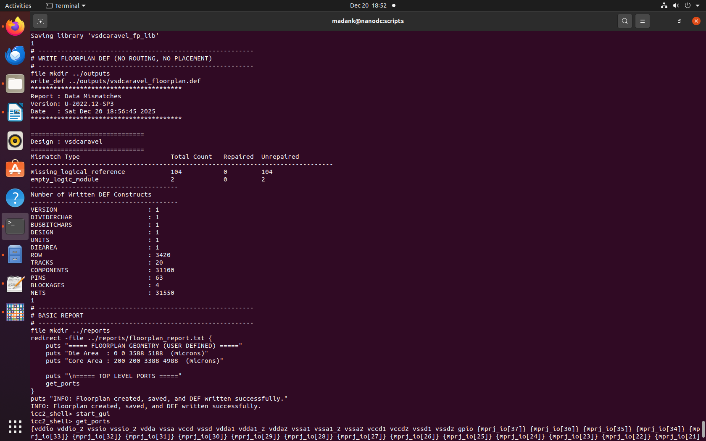
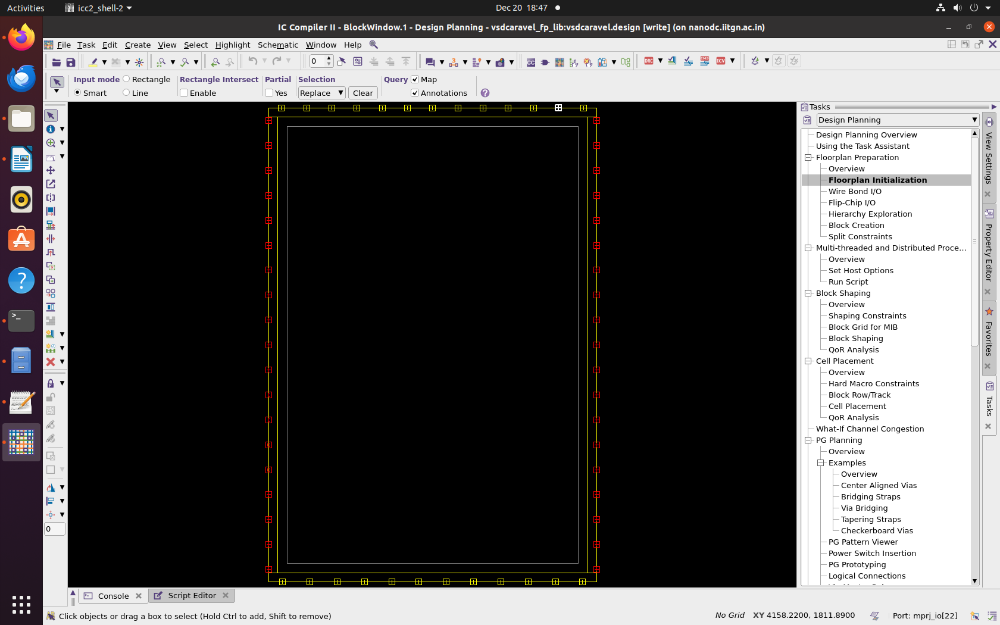

# Task 5: SoC Floorplanning Using ICC2 (Floorplan Only)

## Objective

The objective of this task is to create a clean and correct SoC floorplan using Synopsys ICC2, strictly meeting predefined die size, core dimensions, and IO boundary constraints. This task focuses only on floorplanning, without placement, CTS, or routing, and aims to build hands-on familiarity with ICC2 concepts such as design libraries, reference NDMs, die/core definition, placement blockages, DEF generation, and GUI inspection.

This stage is critical because a correct floorplan forms the foundation for all downstream physical design stages. Any mismatch in die size, core offset, or IO keep-out regions can cause failures later during placement or routing.

---

## Toolchain Requirements

The following tools and libraries are required to reproduce this flow:

* Synopsys ICC2 (Integrated Circuit Compiler II)

---

## Floorplan Overview

The floorplan is created using a TCL-based batch flow in ICC2. The synthesized netlist from DC is used as the input. A new ICC2 design library is created with an SCL-180 reference NDM. The die area and core area are explicitly defined, and hard placement blockages are added around the periphery to reserve space for IO pads.

The output of this task includes:

* An initialized ICC2 design library
* A saved floorplan block
* A DEF file describing die, core, and blockages
* A textual report capturing key floorplan parameters

---

## ICC2 Floorplanning Script

The floorplan is generated using the following TCL script file:

```tcl

```

---

## Running the Floorplanning Flow

The ICC2 shell is invoked using the floorplanning script:

```
icc2_shell -f floorplan.tcl | tee floorplan.log
```

After successful execution, the design library is created, the floorplan is initialized, and the DEF file is generated.



---

## GUI Inspection

The ICC2 graphical interface can be launched using:

```
start_gui
```

Within the GUI, the floorplan initialization section shows the defined die and core dimensions. This confirms that the floorplan geometry matches the intended specification.


The die area is defined as 3588 × 5188 microns, and the core area is offset uniformly by 200 microns on all sides, ensuring sufficient spacing between core logic and IO pads.

---

## Pin Placement

IO pins can be placed automatically for visualization and early validation purposes. This is done directly from the ICC2 GUI console:

```
place_pins -self
```

This command distributes the top-level ports along the periphery without enforcing ordering or side constraints. While not final pin placement, this helps verify port visibility, orientation, and connectivity at the floorplan stage.



---

## Summary

This task successfully establishes a clean SoC floorplan in ICC2 using the synthesized netlist from DC. The die size, core offset, and IO keep-out regions are explicitly controlled through TCL commands, ensuring reproducibility and correctness. The generated DEF and reports serve as a solid handoff point for subsequent placement, CTS, and routing stages.
