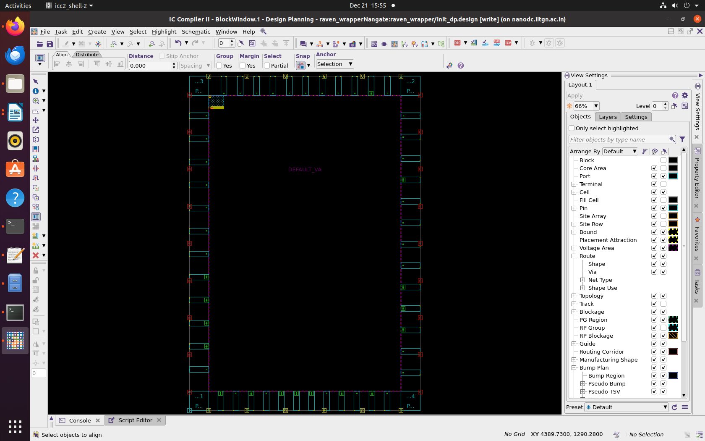
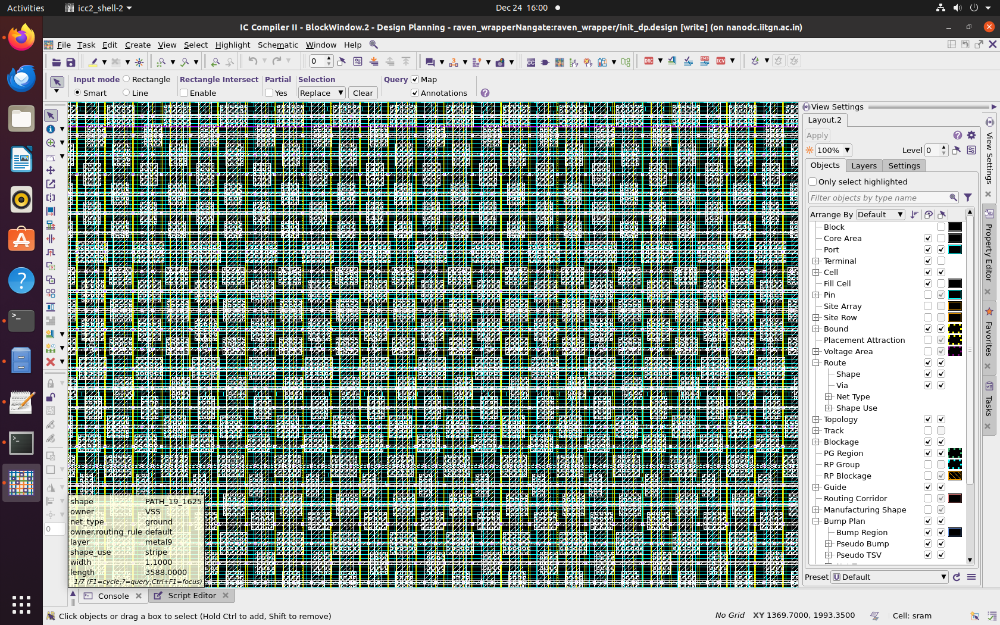
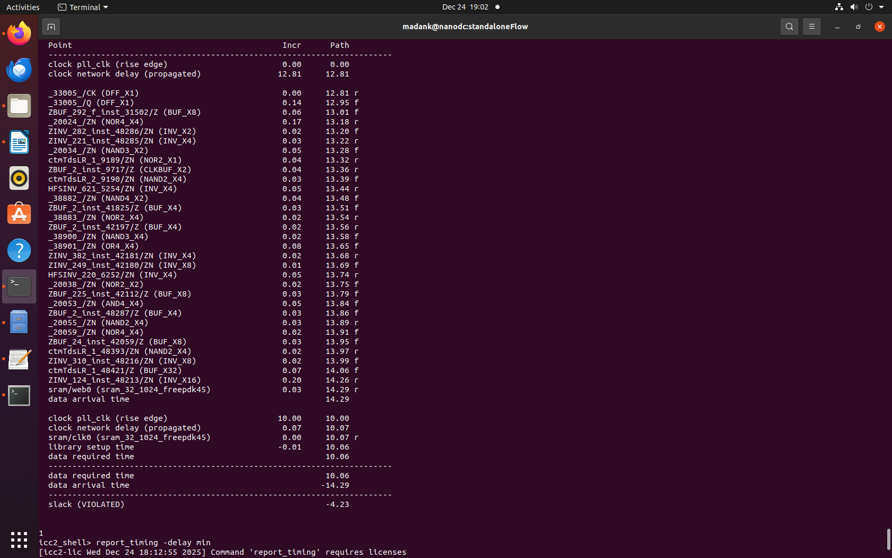
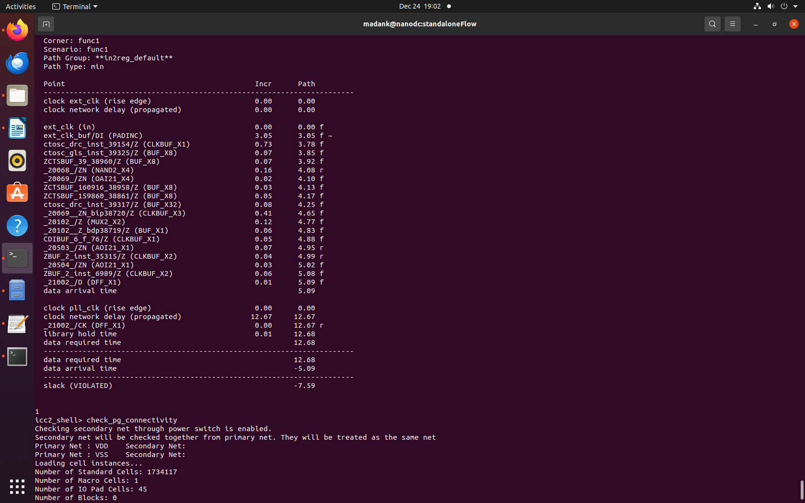

# Task 6: Backend Flow Bring-Up with 100 MHz Performance Target

## Objective

The objective of this task is to set up and validate a complete backend flow capable of supporting a 100 MHz design target using industry-standard backend tools. The same design used during the floorplanning stage is reused here to maintain continuity and correctness across the flow.

This task focuses on:

* Proper backend tool flow sequencing
* Correct usage of file formats and directory paths
* Clean and industry-aligned handoff between tools
* Basic post-route timing validation against a 100 MHz target
* Ensuring physical and timing consistency after placement and routing

## Tools Used

* ICC2 – Placement, Clock Tree Synthesis, and Routing
* Star-RC – Parasitic extraction (SPEF generation)
* PrimeTime – Post-route Static Timing Analysis at 100 MHz

## Previous Progress

### Constraint Update for 100 MHz

The design constraints were updated to target a clock frequency of 100 MHz. This corresponds to a clock period of 10 ns. The updated constraints ensure that all downstream physical and timing optimization stages work toward meeting this frequency target.

### Floorplan Reference

The floorplan created earlier serves as the physical foundation for placement and routing. Core area, macro placement, and initial power intent are preserved.

## Current Progress

## Power Generation

Power generation was successfully completed using a structured ICC2 power planning script. The script defines power grid patterns, strategies, vias, macro rings, macro pin connections, and standard cell rails. Below is a brief explanation of what happens at each stage of the script.

### Power Grid Cleanup and Initialization

Existing power grid strategies, patterns, regions, vias, and routes are removed to ensure a clean start. This avoids conflicts with previous or partial power planning attempts. After cleanup, the power and ground nets are reconnected logically.

### Via Master Rule Definition

A via master rule is defined with an 8×10 via array. This improves current-carrying capability and reduces via resistance, which is especially important for high-frequency designs.

### Macro Identification

All hard macros in the design are collected into a variable. This allows targeted power planning for macros, such as ring creation and pin connections.

### Top-Level Power Mesh Creation

A high-level power mesh is created using:

* Metal9 for horizontal straps
* Metal10 for vertical straps

This mesh provides robust global power distribution across the entire core. Parameters such as width, pitch, spacing, and offset are carefully chosen to balance IR drop, congestion, and routing resources. Vias are automatically inserted at mesh intersections using the defined via master rule.

### Lower-Level Power Mesh (Metal2)

An additional vertical power mesh is created on Metal2, aligned to routing tracks. This mesh helps distribute power closer to standard cells and improves local power integrity.

### Power Grid Strategies

Separate strategies are defined to apply the power mesh patterns to the core region. These strategies specify which nets (VDD and VSS) are assigned to which mesh layers and how the mesh terminates at design boundaries.

### Macro Power Rings

Power rings are created around macros using Metal3 (horizontal) and Metal4 (vertical). These rings provide dedicated and reliable power delivery to macros, isolating them from fluctuations in the standard cell power grid.

Vias are added between macro rings and existing straps to ensure strong electrical connectivity.

### Macro Pin Connections

Macro power pins are connected to the power grid using scattered pin connections on Metal3 and Metal4. This ensures that all macro VDD and VSS pins are properly tied into the power network.

### Standard Cell Power Rails

Standard cell rails are generated automatically, connecting each row of standard cells to VDD and VSS. Appropriate vias are inserted to ensure continuity between the rails and the higher-level power mesh.

### Power Grid Validation

After power generation, multiple checks are performed:

* Missing via checks to detect incomplete vertical connectivity
* DRC checks to ensure rule compliance
* Connectivity checks to confirm that all power pins are properly connected

At this point, power generation is complete and verified.

## Placement, CTS, and Routing

### Timing Estimation

Before actual placement, timing estimation is performed to get an early indication of design performance. Reports are generated for:

* Detailed timing paths
* Quality of Results (QoR)
* Summary QoR metrics

These reports help identify whether the design is roughly aligned with the 100 MHz target before committing to full optimization.

The design state is saved after timing estimation to allow rollback or comparison later.

### Data Preparation

Block data is written out using a helper script. This step prepares the design database for consistent handling during subsequent stages and tool handoffs.

### Placement Optimization

The number of CPU cores is configured to speed up optimization. Placement optimization is then performed to:

* Position standard cells optimally
* Reduce wirelength
* Improve timing and congestion

An option is enabled to allow placement to proceed even if scan definitions are missing, which is useful during early bring-up.

### Clock Tree Synthesis

Clock optimization is performed to:

* Build a balanced clock tree
* Control clock skew and insertion delay
* Improve setup and hold timing

CTS is a critical step for achieving reliable operation at 100 MHz.

### Routing

Automatic routing is executed with a limited number of detailed routing iterations. This step:

* Connects all signal nets
* Finalizes power grid integration
* Resolves congestion and DRC issues

### Filler Cell Insertion

Standard cell filler cells are inserted to:

* Maintain well continuity
* Avoid DRC violations related to spacing
* Ensure proper power rail continuity

### Final Design Save

The post-route design is saved along with all associated libraries, marking the completion of placement and routing.

## Placement and Routing Results

Placement and routing were executed successfully using the above script.

The zoomed-in routing view shows well-distributed signal routing and a clearly visible power mesh, indicating good physical utilization and routing quality.

## Timing Analysis Results

Post-route timing was analyzed using maximum and minimum delay reports.

* Maximum delay analysis verifies setup timing at the 100 MHz target
* Minimum delay analysis checks for potential hold violations

The timing reports confirm that the backend flow is correctly set up and capable of supporting a 100 MHz operating frequency, validating the placement, CTS, and routing stages.
